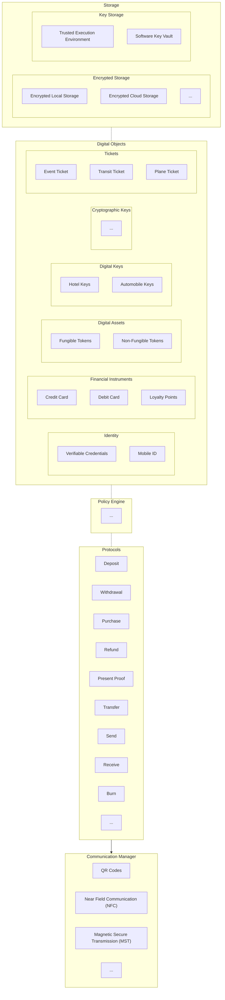

# Architecture Task Force
This task force is intended to deliver a reference architecture for what the OpenWallet Foundation is looking to build. We are using [issues tagged with `module`](https://github.com/openwallet-foundation/architecture-task-force/issues?q=is%3Aissue+label%3Amodule) to define the different modules that we expect to find in the reference architecture.

## Conceptual Architecture (DRAFT)

 This work is licensed under a <a rel="license" href="http://creativecommons.org/licenses/by/4.0/">Creative Commons Attribution 4.0 International License</a>.
