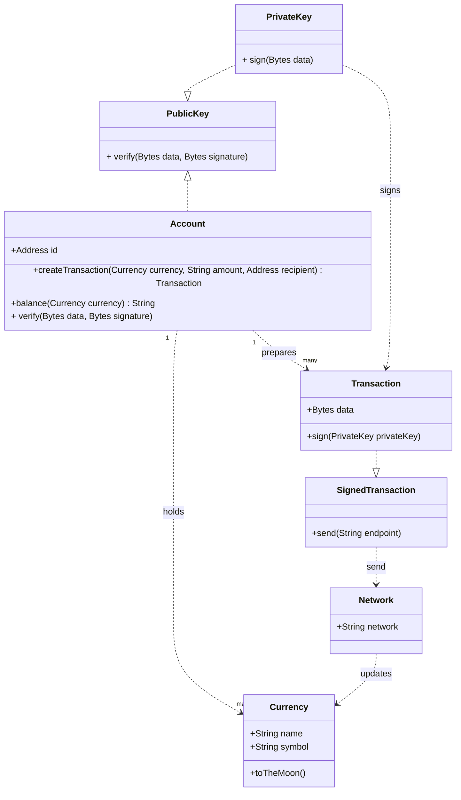

 

# Crypto Currencies

```mermaid
classDiagram


class Network {
    +String network
}

class Currency {
    +String name
    +String symbol
    +toTheMoon()
}


class PublicKey {
    + verify(Bytes data, Bytes signature)
}

class PrivateKey {
    + sign(Bytes data)
}

class Account {
    +Address id
    +createTransaction(Currency currency, String amount, Address recipient) Transaction
    +balance(Currency currency) String
    + verify(Bytes data, Bytes signature)
}

class Transaction {
    +Bytes data
    +sign(PrivateKey privateKey)
}

class SignedTransaction {
    +send(String endpoint)
}


PrivateKey ..|> PublicKey
PublicKey <|.. Account

Account "1" ..> "many" Currency     : holds
Account "1" ..> "many" Transaction  : prepares

PrivateKey ..> Transaction : signs
Transaction ..|> SignedTransaction


SignedTransaction ..> Network : send

Network ..> Currency : updates
```

 This work is licensed under a <a rel="license" href="http://creativecommons.org/licenses/by/4.0/">Creative Commons Attribution 4.0 International License</a>.