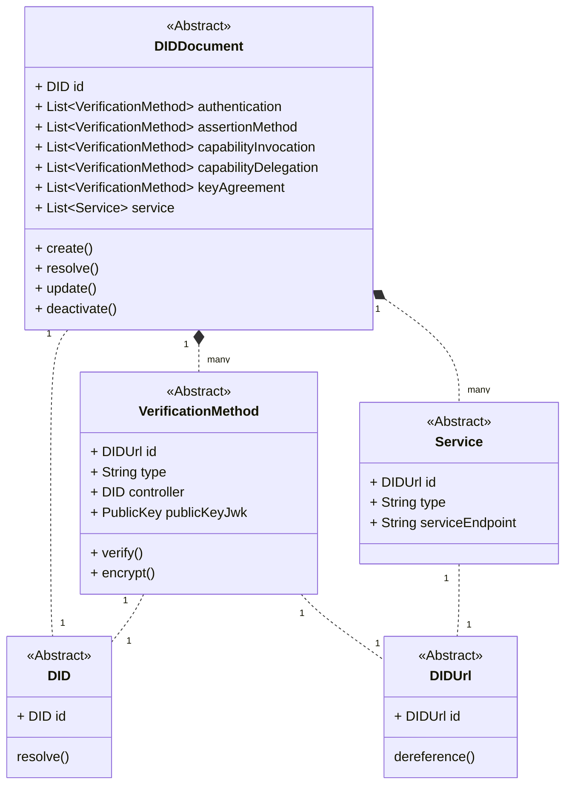

# Decentralized Identifiers

```mermaid
classDiagram


class DID {
    <<Abstract>>
    + DID id
    resolve()
}

class DIDUrl {
    <<Abstract>>
    + DIDUrl id
    dereference()
}

class DIDDocument {
    <<Abstract>>
    + DID id
    + List~VerificationMethod~ authentication
    + List~VerificationMethod~ assertionMethod
    + List~VerificationMethod~ capabilityInvocation
    + List~VerificationMethod~ capabilityDelegation
    + List~VerificationMethod~ keyAgreement
    + List~Service~ service
    + create()
    + resolve()
    + update()
    + deactivate()
}

class VerificationMethod {
    <<Abstract>>
    + DIDUrl id
    + String type
    + DID controller
    + PublicKey publicKeyJwk
    + verify()
    + encrypt()
}

class Service {
    <<Abstract>>
    + DIDUrl id
    + String type
    + String serviceEndpoint
}
DIDDocument "1" .. "1" DID
DIDDocument "1" *.. "many" VerificationMethod
VerificationMethod "1" .. "1" DIDUrl
VerificationMethod "1" .. "1" DID
DIDDocument "1" *.. "many" Service
Service "1" .. "1" DIDUrl
 
```
