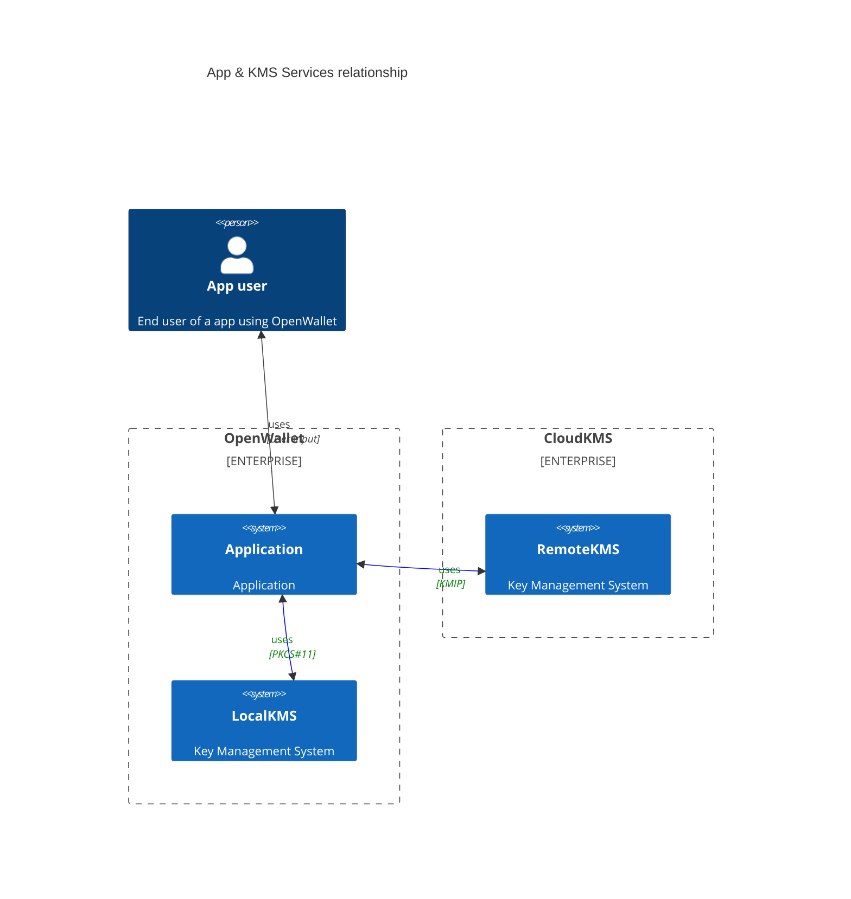

 

# Key Management Services

- [edit live](https://mermaid.live/edit)

This document describes conceptually the relationship between application and key management services.

## KMS Principles

- **Isolation**: The application and the key management service are isolated from each other. The application should not be able to access the key management service directly or shared runtime resources. The application run-time space should be considered **UNTRUSTED**.
    
    - Isolation Strategies:

        - **In-memory** Run-time:
            - `Trusted Execution Environment` - Dedicated run-time space where it only runs trusted pre-compiled vetted code. They should have tampering resistance and detection mechanisms. (e.g., [Trusty TEE](https://source.android.com/security/trusty))
            - `Processes` - The application and the key management service run in separate processes.
            - `Containers & Virtualization` - The application and the key management service run in separate containers. (e.g., [HashiCorp Vault](https://www.vaultproject.io/))
        - **Hardware**:
            - `HSM` - The application and the key management service run on separate hardware. (i.e [HSM](https://en.wikipedia.org/wiki/Hardware_security_module))
            - `Hardware Wallets` - Established hardware wallets in the cryptocurrency space. But integration is vendor specific and **NOT** standardized or security compliance friendly. Also, addition of new features is dependent on the vendor. (e.g., [Ledger](https://www.ledger.com/), [Trezor](https://trezor.io/))
            - `Over the Network` - The application and the key management service run on separate cloud HSMs. (e.g., [AWS CloudHSM](https://aws.amazon.com/cloudhsm/))

- **Access Control**: The application should only be able to access the key management service through a well defined interface. The key management service should be able to control access to its resources.

- **Tampering Detection**: The key management service should be able to detect if the application has been tampered with.

- **Integration APIs**: The application should be able to use standard APIs to access the key management service. This can help with `interoperability`, `portability` and `compliance`.

    - Examples of standard APIs:

        - [PKCS#11](https://en.wikipedia.org/wiki/PKCS_11) is a standard API for cryptographic tokens. It is used by many applications to access cryptographic tokens such as smart cards and hardware security modules (HSM).
        - [KMIP](https://en.wikipedia.org/wiki/Key_Management_Interoperability_Protocol) is a standard API for key management services. It is used by many applications to access key management services.
        - [IPC](https://en.wikipedia.org/wiki/Inter-process_communication) If isolation is achieved through processes, then the application and the key management service can communicate through IPC. 
        - `REST` - Some secret management systems use REST APIs to access key management services. [HashiCorp Vault](https://www.vaultproject.io/) is an example of such a system.
        - `Vendor Specific` - Some key management services use vendor specific APIs. [Ledger](https://www.ledger.com/) and [Trezor](https://trezor.io/) are examples of such systems.
        - **`OpenWallet?`** - Perhaps the creation of a **NEW** standard API for key management services is needed. Old standards can be hard to work with modern crypto (i.e BIP32/39/44 derivations paths, EdDSA, Multi-sig schemes, MPC, etc). **OR** adapting or expanding on existing standards to support modern crypto.
        - `Others` - To be added.

## Dependence of device manufacturers and operating systems

A conceptual design such as this does **NOT** try to take into account the specific limitations and hardware availability of device manufacturers and operating systems. Depending on the environment we run a wallet, we might need dedicated detailed designs to achieve isolation, tampering detection, access policies and to make sure we can support all the crypto primitives an OpenWallet compliant wallet might need. 

### Environments to Consider?
    - Android
    - iOS
    - Browser Extensions
    - Desktop versions

## Conceptual High Level Design

 This work is licensed under a <a rel="license" href="http://creativecommons.org/licenses/by/4.0/">Creative Commons Attribution 4.0 International License</a>.