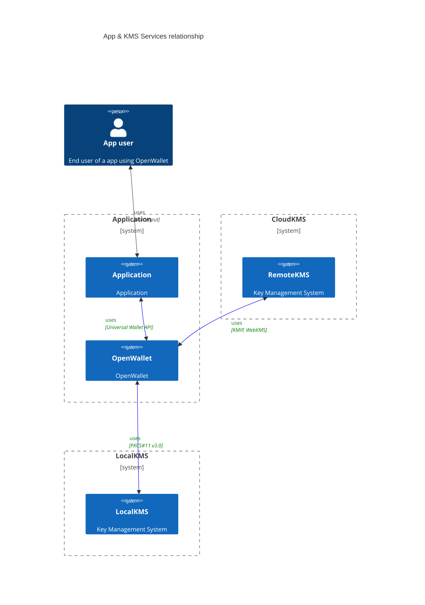
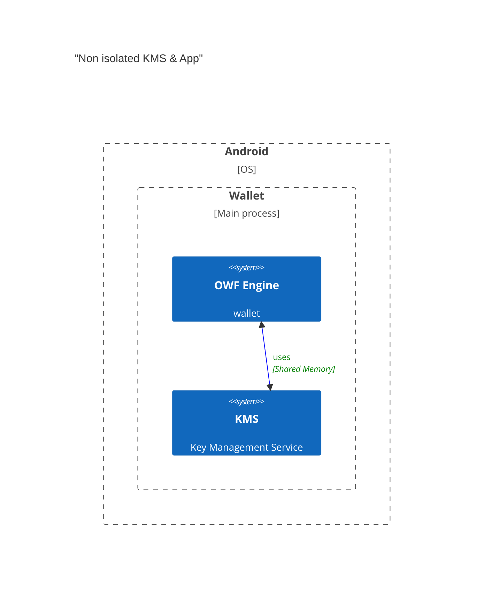
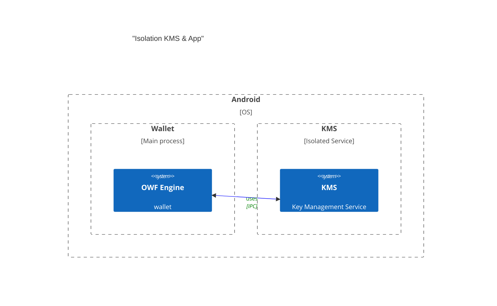
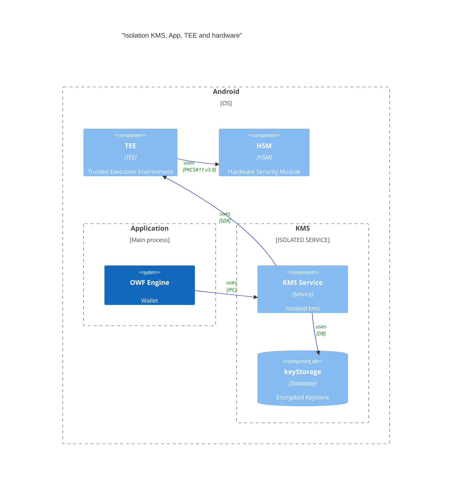

 

# Key Management Services

- [edit live](https://mermaid.live/edit)

This document describes conceptually the relationship between application and key management services.

## KMS Principles

- **Crypto agility**: The KMS should be able to support a wide range of crypto primitives. It should be able to support legacy crypto as well as modern cryptography.

- **Isolation**: The application and the key management service are isolated from each other. The application should not be able to access the key management service directly or shared runtime resources. The application run-time space should be considered **UNTRUSTED**.
    
    - Isolation Strategies:

        - **In-memory** Run-time:
            - `Trusted Execution Environment` - Dedicated run-time space where it only runs trusted pre-compiled vetted code. They should have tampering resistance and detection mechanisms. (e.g., [Trusty TEE](https://source.android.com/security/trusty))
            - `Processes` - The application and the key management service run in separate processes.
            - `Containers & Virtualization` - The application and the key management service run in separate containers. (e.g., [HashiCorp Vault](https://www.vaultproject.io/))
        - **Hardware**:
            - `HSM` - The application and the key management service run on separate hardware. (i.e [HSM](https://en.wikipedia.org/wiki/Hardware_security_module))
            - `Hardware Wallets` - Established hardware wallets in the cryptocurrency space. But integration is vendor specific and **NOT** standardized or security compliance friendly. Also, addition of new features is dependent on the vendor. (e.g., [Ledger](https://www.ledger.com/), [Trezor](https://trezor.io/))
            - `Over the Network` - The application and the key management service run on separate cloud HSMs. (e.g., [AWS CloudHSM](https://aws.amazon.com/cloudhsm/))

- **Access Control**: The application should only be able to access the key management service through a well defined interface. The key management service should be able to control access to its resources.

- **Tampering Detection**: The key management service should be able to detect if the application has been tampered with.

- **Integration APIs**: The application should be able to use standard APIs to access the key management service. This can help with `interoperability`, `portability` and `compliance`.

    - Examples of standard APIs:

        - [PKCS#11](https://en.wikipedia.org/wiki/PKCS_11) is a standard API for cryptographic tokens. It is used by many applications to access cryptographic tokens such as smart cards and hardware security modules (HSM).
            - `note`: PKCS#11 v3.0 is the latest version of the standard. It is a major update to the standard. It adds support for modern crypto such as EdDSA, Edwards curve, Curve25519 on top of the existing RSA, ECDSA, AES, SHA, etc.
        - [KMIP](https://en.wikipedia.org/wiki/Key_Management_Interoperability_Protocol) is a standard API for key management services. It is used by many applications to access key management services.
        - [IPC](https://en.wikipedia.org/wiki/Inter-process_communication) If isolation is achieved through processes, then the application and the key management service can communicate through IPC. 
        - `REST` - Some secret management systems use REST APIs to access key management services. [HashiCorp Vault](https://www.vaultproject.io/) is an example of such a system.
        - `Vendor Specific` - Some key management services use vendor specific APIs. [Ledger](https://www.ledger.com/) and [Trezor](https://trezor.io/) are examples of such systems.
        - **`OpenWallet?`** - Perhaps the creation of a **NEW** standard API for key management services is needed. Old standards can be hard to work with modern crypto (i.e BIP32/39/44 derivations paths, EdDSA, Multi-sig schemes, MPC, etc). **OR** adapting or expanding on existing standards to support modern crypto.
        - [WebKMS](https://w3c-ccg.github.io/webkms) - Specification published by the [Credentials Community Group](https://www.w3.org/groups/cg/credentials). It is a REST API for key management services.
        - [Universal Wallet](https://w3c-ccg.github.io/universal-wallet-interop-spec) - JSON-LD representation for interoperability between digital currencies and identity wallets

## Dependence of device manufacturers and operating systems

A conceptual design such as this does **NOT** try to take into account the specific limitations and hardware availability of device manufacturers and operating systems. Depending on the environment we run a wallet, we might need dedicated detailed designs to achieve isolation, tampering detection, access policies and to make sure we can support all the crypto primitives an OpenWallet compliant wallet might need. 

### Environments to Consider?
    - Android
    - iOS
    - Browser Extensions
    - Desktop versions

## Hardware Support

This section intends to list crypto primitives that are normally supported by most hardware devices (i.e phones, laptops, etc). We are excluding cryptocurrency specific hardware devices (i.e Ledger, Trezor, etc) from this list as they are **not** interoperable. 

The usual expected support for crypto primitives are: 

- RSA (2048, 4096 bit size keys)
- ECDSA
    - 224, 256, 384, and 521-bit key support are supported, using the NIST P-224, P-256, P-384, and P-521 curves, respectively

- AES
    - 128, 256-bit keys
    - CBC, CTR, ECB, and GCM

- HMAC, SHA-256

There can be some variations in the support of these crypto primitives, hashing functions and key sizes, depending on the hardware device and manufacturer.

### References

- [Android Keystore System](https://source.android.com/docs/security/features/keystore/features#primitives)
- [iOS Enclave](https://developer.apple.com/documentation/cryptokit/secureenclave#using-the-secure-enclave)
    - note: iOS supports Curve25519 and EdDSA but is **NOT** hardware backed. **Only** NIST P-256 is hardware backed.

## Conceptual High Level Design

### Hardware Operations

By hardware we are referring to TPMs, HSMs, Smart Cards and / or security keys.

### Non-Hardware Operations

Given that a wallet maybe be deployed or installed in a OS or environment that does not have hardware available that can provide all the cryptographic operations needed, we need to consider a non-hardware mode of operation.

Given the [**principles**](#kms-principles) we have defined, particularly the `isolation` principle, we need to consider a way to achieve isolation in a non-hardware environment. 

Because we are dependent on the run-time environment to provide isolation, we should consider OS'es specifics and their capabilities in order to achieve a secure design.

#### Standard Web3 Design

##### Problem with Shared Run-time space
- Shared resources
- Permissions to the app open attack surface
- No compartmentalization of a breach or zero-day exploit
Non compliant with some security industry standards and regulations where separation of duties is a must
- Breaks isolation principle

##### Precedence for software based enclaves

There's already precendence outside of web3 for software-only based enclaves. For example:
- [HashiCorp Vault](https://www.vaultproject.io/)
- [softHSM](https://www.opendnssec.org/softhsm/)
- [Apple CryptoKit](https://developer.apple.com/documentation/cryptokit)
    - note: Only NIST P-256 is hardware backed. Curve25519 and EdDSA are **NOT** hardware backed.

#### Isolation Strategies

- Virtualization
- Containers
- Separate Applications
- Processes & Services
- Trusted Execution Environments

##### High Level Conceptual Design

#### Key Material Handling

- Use device bound hardware for encryption / decryption
- At rest encryption with native support through TEE & phone’s native HSM 
- At run-time decrypt only necessary keys
- The application is blind to any private key material and should only request operations from the KMS. Operations can be (not excluded to):
    - Key-gen
    - Get-publicKey
    - Sign
    - Key-derive
    - Key-import 
    - etc

##### Encryption at rest methods
- Hardware backed Symmetric key: Applications can choose to encrypt their key stores and / or data directly with a hardware backed key bound to the device.

- Key Wrapping: Encrypt symmetric keys with another hardware backed key. The application can then store the encrypted key in a database or file. The application can then decrypt the key when needed. This can be done through native TEE's or local secure element in the device.

- Key Aggrement: Applications can choose to use key agreement schemes to derive a symmetric key (i.e ECDH) that is used to encrypt & decrypt it's keysores and / or data.

###### KMS Isolated Service Detailed Relationships

#### OS Specifics

The examples above are conceptual designs and not **prescriptive**. We need to consider the specifics of the OS we are running on. For example,

- Android
    - Supports isolated services
    - Lifecycle control
    - Natural sandboxing between apps
    - TEE + HSM available for at-rest / transit encryption
- iOS
    - Isolated services seem to be only possible through Scheduled Tasks (https://developer.apple.com/documentation/backgroundtasks) 
    - Besides the traditional NIST crypto; Apple has native support for Curve25519, EdDSA, ECDH, xchacha20 symmetric encryption scheme

 This work is licensed under a <a rel="license" href="http://creativecommons.org/licenses/by/4.0/">Creative Commons Attribution 4.0 International License</a>.