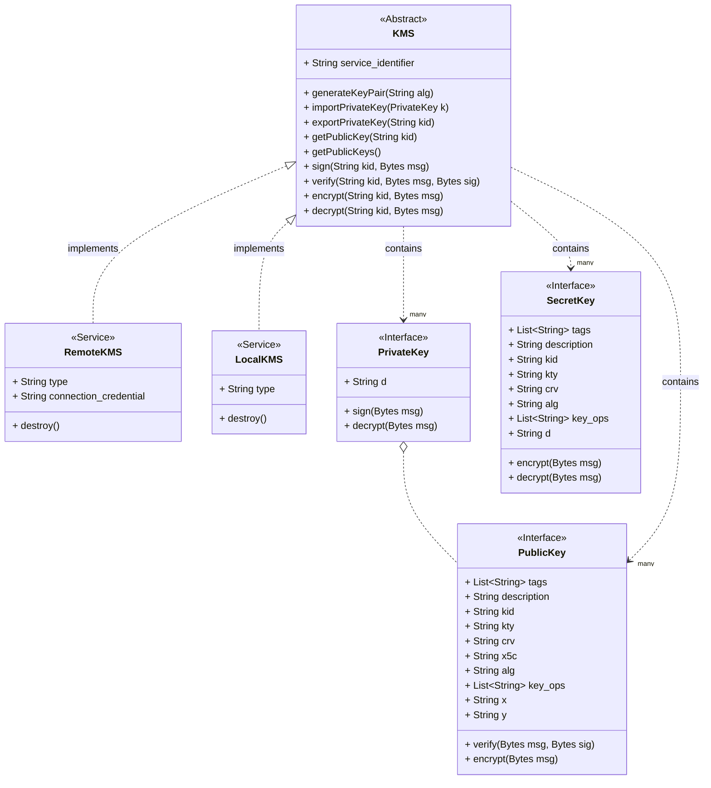

# Key Management Services

- [edit live](https://mermaid.live/edit)

This document describes generic key management services.

Note that this module is not related to "storing digital objects" that are cryptographic keys.

It is referring to the internal interfaces needed to securely manage "digital object".

