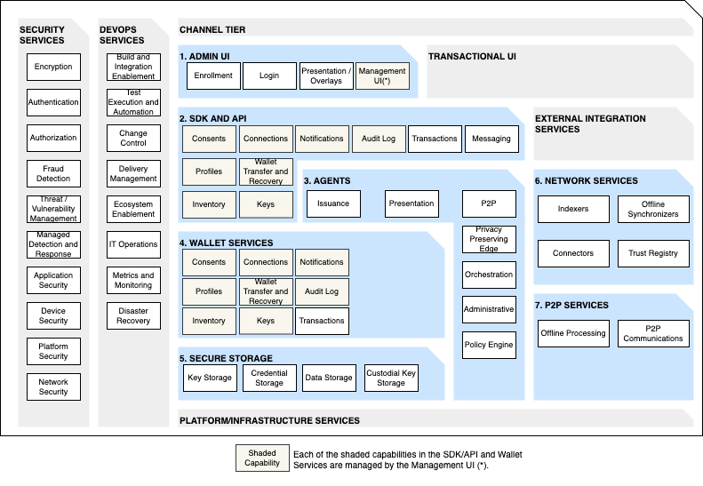

# Universal Wallet Reference Architecture Whitepaper

- [Introduction](#introduction)
- [Background](#background)
- [Requirements](#requirements)
    - [Functional Requirements](#functional-requirements)
        - [Use Cases](#use-cases)
        - [Business Features](#business-features)
            - [User Experience](#user-experience)
            - [Transactions and Payments](#transaction-and-payments)
            - [Credential and Identity Management](#credential-and-identity-management)
            - [Interoperability and Integration](#interoperability-and-integration)
            - [Security and Privacy](#security-and-privacy)
    - [Non-functional Requirements](#non-functional-requirements)
        - [Functional Suitability](#functional-suitability)
        - [Performance Efficiency](#performance-efficiency)
        - [Compatibility](#compatibility)
        - [Flexibility](#flexibility)
        - [Reliability](#reliability)
        - [Security](#security)
        - [Safety](#safety)
        - [Maintainability](#maintainability)
        - [Usability](#usability)
        - [Sustainability](#sustainability)
- [Principles](#principles)
    - [Multi-purpose](#multi-purpose)
    - [Privacy](#privacy)
    - [Interoperable](#interoperable)
    - [Portable](#portable)
    - [Equitable Access](#equitable-access)
    - [Open](#open)
- [Conceptual Architecture](#conceptual-architecture)
- [Information Model](#information-model)
- [Logical Architecture](#logical-architecture)
    - [Technology Capabilities](#technology-capabilities)
        - [Admin UI](#admin-ui)
        - [SDK and API](#sdk-and-api)
        - [Agents](#agents)
        - [Wallet Services](#wallet-services)
        - [Secure Storage](#secure-storage)
        - [Network Services](#network-services)
        - [P2P Services](#p2p-services)
    - [Technology Enablers](#technology-enablers)
        - [Cross Cutting Enablers](#cross-cutting-enablers)
        - [Identity Enablers](#identity-enablers)
        - [Objects Enablers](#objects-enablers)
        - [Money Enablers](#money-enablers)
    
## Introduction

The Universal Wallet Reference Architecture whitepaper describes an architecture for a universal B2C wallet -- that is, one that supports identity, objects (e.g., tokens, tickets), and money (e.g., credit cards and other financial instruments). It is important to note that the architecture described in this document does not assume a particular technology or delivery mechanism for the wallet.

In this paper, we will begin by providing background on why a universal wallet is needed. Next, we will explore some typical requirements (both functional and non-functional) for a universal wallet. Next, we will expand on a set of principles that will be used when making decisions about the architecture. The paper will then document a conceptual architecture that shows the key components and how we expect them to interact with each other. We will follow this with an information model of the entities that interact with a wallet. We will then explore the logical architecture, which includes the technical capabilities that we expect will be needed to support the requirements of a universal wallet. Lastly, we will look at a set of enablers that might accelerate the implementation of a universal wallet.

The audience of this paper are developers and architects wishing to use or create open-source wallets and components. Although, there are other readers of this document that may be interested in the general concepts of universal wallets.

Out of scope for this document are the following items:
- Defining an end-user wallet product, including User Interfaces
- Defining any sort of technical specification or standard
- Deep dives on items like protocols, formats, schemas, cryptography, and signatures that are used by the wallet engine (these should be covered by the technical specifications and standards)
- Specific detailed differences between types of wallets

## Background
With the advent of Bitcoin and blockchains, we started exploring tokenizing people’s and organizations’ identities, assets, processes, and things (connected and unconnected). This has led to an environment where many different types of wallets exist.


Today, we have our physical wallets. These types of wallets store our physical assets, and we use them for in-person transactions only. We also have mobile wallets. These types of wallets started with mobile payments and have advanced to storing boarding passes, tickets, and loyalty cards. We can use these apps both for in-person and remote transactions. There are currently two sub-types of mobile wallets: (1) OS-based that are provided by the mobile operating system provider (e.g., Google Wallet, Apple Wallet) and (2) App-based that are provided by a specific consumer company (e.g., personal bank app). The third type of wallet that has been introduced are single-purpose digital wallets. These types of wallets can be broken into three sub-types: (1) digital identity wallets, which hold signed verifiable credentials, (2) cryptocurrency / digital asset wallets, which hold secret keys that control wallet addresses and store cryptocurrencies, and (3) token wallets, which hold digital objects and NFTs.

Where we want to get to is a place where we have multi-purpose digital wallets (or universal wallets). These wallets will provide users with the ability to carry their digital identity credentials, payment credentials, and digital objects across boundaries, ecosystems, and physical and digital environments. We expect that there will be a massive business model change coming where the winning digital business shifts from those who collect the most user data to those who earn users' trust to willingly hand over their data. These user-controlled and intelligent wallets will foster automation, privacy, and portability across our digital interactions and will change how we act and do business across physical and virtual worlds. Specifically, we will use our identity (e.g., digital passports, mobile driver's license, verifiable credentials, certifications) to allow people and companies to securely share and verify information in physical and virtual places. Our money (e.g., CDBC, cryptocurrencies, stablecoins, debit and credit networks) will become digitally native, enabling a seamless payment experience in physical and virtual places. We will be able to carry our objects (e.g., tokenized loyalty points, digital arts and collectibles, tokenized physical assets, digital securities) with us in physical and virtual places.

## Requirements

In this section, we will explore a high-level set of functional requirements, some use cases for different industries, and a set of business features that are needed for a universal wallet. This section should be considered illustrative and not exhaustive.

### Functional Requirements
A **functional requirement** defines specific behaviors or functions.

- Storing multiple types of keys (e.g., hotel keys, car keys, cryptographic keys)
- Storing data (e.g., travel documents, verifiable credentials)
- Connecting to multiple networks (e.g., cryptocurrencies, stable coins, blockchain, payment, credit card, CDBC, bank)
- Digital asset inventory management
- Authenticating with the wallet to access services
- Secure access to wallet
- Self custody as well as custodial solution
- Consent for data sharing
- Delegation of consents to agents (human or digital)
- Proving ownership
- Backup and Recovery

#### Use Cases
The following is a non-exhaustive list of use cases by industry:


#### Business Features

##### User Experience
- Push Notifications
- Passwordless Login
- In-App / Direct Messaging
- Registration
- Consent Management
- Delegation Management
- Preference Center
- Personalized Insights/Analytics
- Import/Export
- Multi-factor Authentication
- Multi-Language Support
- Customer Support/Help
- Personalized Ads
- Edge Agent Store
- Documentation

##### Transaction and Payments
- Transaction Processing (DeFi / CeFi)
    - presenting proofs
    - online payments
    - transfer to/from
    - contactless payments
    - P2P transfers
    - subscriptions
    - access/authorization
- Virtual Cards
- Loyalty Programs
- Digital Receipts
- Instant messaging with contacts
- Asset ownership
- Multi-network Support

##### Credential and Identity Management
- Connections
- Key Management
- Identity Verification
- Digital Signatures
- Inventory Management
- Receive and Manage Digital Credentials
- Verifiable PDF Documents
- Import Physical Cards
- Multi-persona (Multiple Identities / Profiles)

##### Interoperability and Integration
- Access/Authorization
- Transaction History
- Audit Log
- Offline Usage
- Recovery
- Backup/Restore
- Cross-Platform Accessibility
- Wallet Synchronization

##### Security and Privacy
- Custody (Self, Segregated, Shared)
- Multisig
- Secure Storage (credentials, keys, documents)
- Policy Engine
- Privacy Protection
- Encryption
- Own Your Data

### Non-Functional Requirements

A **non-functional requirement** is a requirement that specifies criteria that can be used to judge the operation of a system, rather than specific behaviors. The NFRs included in this document should be considered illustrative and should be carefully considered for each specific physical architecture and implementation.

#### Functional Suitability
This characteristic represents the degree to which a product or system provides functions that meet stated and implied needs when used under specified conditions.

- **Functional completeness** - Degree to which the set of functions covers all the specified tasks and user objectives.
- **Functional correctness** - Degree to which a product or system provides the correct results with the needed degree of precision.
- **Functional appropriateness** - Degree to which the functions facilitate the accomplishment of specified tasks and objectives

#### Performance Efficiency
This characteristic represents the performance relative to the number of resources used under stated conditions.

- **Time behavior** - Degree to which the response and processing times and throughput rates of a product or system, when performing its functions, meet requirements.
- **Resource utilization** - Degree to which the amounts and types of resources used by a product or system, when performing its functions, meet requirements.
- **Capacity** - Degree to which the maximum limits of a product or system parameter meet requirements.
- **Monitoring** – Degree to which the solution is capable of measuring and reporting on the performance KPIs of the overall system.

#### Compatibility
Degree to which a product, system or component can exchange information with other products, systems or components, and/or perform its required functions while sharing the same hardware or software environment.

- **Co-existence** - Degree to which a product can perform its required functions efficiently while sharing a common environment and resources with other products, without detrimental impact on any other product.
- **Interoperability** - Degree to which two or more systems, products or components can exchange information and use the information that has been exchanged.
- **Standards** – Degree to which the system uses open standards for data exchange or defines the interface to standardize communication between systems.
- **Channel Support** – Degree to which a wallet supports multiple channels (e.g., web, mobile). Consider whether each channel is a separate wallet or if there are requirements to share the same data across multiple channels.
- **Directed Communication** – Degree to which the wallet supports peer-to-peer communication.
- **Integration** – Degree to which the wallet can integrate with existing or new systems while exposing relevant capabilities, while practicing least privilege, via publishing, APIs, SDKs, or other broadcasting.

#### Flexibility
Capability of a product to serve a different or expanded set of requirements or contexts of use; or the ease with which the product can be adapted to changes in its requirements, contexts of use, or system environment.

- **Adaptability** - Capability of a product to be effectively and efficiently adapted for or transferred to different hardware, software or other operational or usage environments.
- **Scalability** - Capability of a product to handle growing or shrinking workloads or the ease with which the product’s capacity can be adapted to handle variability.
- **Installability** - Capability of a product to be effectively and efficiently installed successfully and/or uninstalled in a specified environment.
- **Replaceability** - Capability of a product to replace another specified product for the same purpose in the same environment.

#### Reliability
Degree to which a system, product or component performs specified functions under specified conditions for a specified period.

- **Maturity** - Degree to which a system, product or component meets needs for reliability under normal operation.
- **Availability** - Degree to which a system, product or component is operational and accessible when required for use.
- **Fault tolerance** - Degree to which a system, product or component operates as intended despite the presence of hardware or software faults.
- **Recoverability** - Degree to which, in the event of an interruption or a failure, a product or system can recover the data directly affected and re-establish the desired state of the system.

#### Security
Degree to which a product or system protects information and data so that persons or other products or systems have the degree of data access appropriate to their types and levels of authorization.

- **Confidentiality** - Degree to which a product or system ensures that data are accessible only to those authorized to have access.
- **Integrity** - Degree to which a system, product or component prevents unauthorized access to, or modification of, computer programs or data.
- **Non-repudiation** - Degree to which actions or events can be proven to have taken place so that the events or actions cannot be repudiated later.
- **Accountability** - Degree to which the actions of an entity can be traced uniquely to the entity.
- **Authenticity** - Degree to which the identity of a subject or resource can be proved to be the one claimed.
- **Privacy** – Degree to which a product or system secures the keys and data specific to a user.
- **Auditability** – Degree to which a product or system has availability to a history of data origination and exchange, access, and changes.

#### Safety
This characteristic represents the capability of a product under defined conditions to avoid a state in which human life, health, property, or the environment is endangered.

- **Operational Constraint** - Capability of a product to constrain its operation to within safe parameters or states when encountering operational hazard.
- **Risk Identification** - Capability of a product to identify a course of events or operations that can expose life, property or environment to unacceptable risk.
- **Fail Safe** - Capability of a product to automatically place itself in a safe operating mode, or to revert to a safe condition in the event of a failure.
- **Hazard Warning** - Capability of a product to provide warnings of unacceptable risks to operations or internal controls so that they can react in sufficient time to sustain safe operations
- **Safe Integration** - Capability of a product to maintain safety during and after integration with one or more components.
- **Test Environments** – Capability of testing within separate environments (i.e., development, test, acceptance, production).

#### Maintainability
This characteristic represents the degree of effectiveness and efficiency with which a product or system can be modified to improve it, correct it or adapt it to changes in environment, and in requirements.

- **Modularity** - Degree to which a system or computer program is composed of discrete components such that a change to one component has minimal impact on other components.
- **Reusability** - Degree to which an asset can be used in more than one system, or in building other assets.
- **Analyzability** - Degree of effectiveness and efficiency with which it is possible to assess the impact on a product or system of an intended change to one or more of its parts, or to diagnose a product for deficiencies or causes of failures, or to identify parts to be modified.
- **Modifiability** - Degree to which a product or system can be effectively and efficiently modified without introducing defects or degrading existing product quality.
- **Testability** - Degree of effectiveness and efficiency with which test criteria can be established for a system, product or component and tests can be performed to determine whether those criteria have been met.
- **Configurability** – Degree to which the elements within the architecture can be configured and that tools exist to manage the configuration.
- **Automation** – Degree to which the build, test, deploy, and deliver processes are automated and whether the process for promoting changes is defined.

#### Usability
Capability of a product to be used by specified users to exchange information between a user and an interactive system via the user interface to complete the intended task.

- **Appropriateness Recognizability** - Capability of a product to be recognized by users as appropriate for their needs.
- **Learnability** - Capability of a product to have specified users learn to use specified product functions within a specified amount of time.
- **Operability** - Capability of a product to have facilities and attributes that make it easy to operate and control.
- **User Error Protection** - Capability of a product to protect users against making operation errors.
- **User Engagement** - Capability of a product to present functions and information in an inviting and motivating manner supporting continued interaction.
- **User Assistance** - Capability of a product to be used by people with the widest range of characteristics and capabilities to achieve specified goals in a specified context of use. The range of capabilities includes language differences and disabilities associated with age, sight, hearing, use of hands, arms and legs, etc.
- **Self-Descriptiveness** - Capability of a product to present appropriate information, where needed by the user, to make its capabilities and use immediately obvious to the user without excessive interactions with a product or other resources.

#### Sustainability
This concern focuses on the common social goal to design and implement software applications with emphasis on energy efficiency and environmental sustainability.   Sustainable development can be interpreted through quality criteria and metrics well known from the standard quality models for software e.g. ISO 25000 (SQuaRE).

- **Reusability** - the ability of software components to be reused in other software systems, reduces efforts to develop other software systems and thus reduces environmental impacts of the development phase.
- **Modifiability** - the ability to implement changes of software quickly, reduces environmental impacts that result from developing and maintaining a software system.
- **Usability and Accessibility of software** - contribute to social aspects, as they make software easier to learn, more accessible to users with disabilities, or more accessible to people with-out access to computers with sufficient performance or screen sizes.
- **Predictability** - which refers to the development process itself, is the ability of the developers to accurately estimate person-days for required features. This contributes to social aspects, as it improves the developers’ conditions of work by reducing the probability of overtime work.

## Principles
A **principle** is a statement of belief, approach, or intent which directs the formulation of the architecture. Principles will be used to make decisions and guide the architecture.


The high-level principles of this architecture are:

- **Multi-purpose** - Focus on more than a single use case (identity, objects, and money)
- **Privacy** - Support and preserve the user's privacy
- **Interoperable** - Leverage open standards and test suites to allow data within the wallet to be used where needed
- **Portable** - Allow user to move from one wallet to another wallet (avoid wallet lock-in)
- **Equitable Access** - Shall not exclude or discriminate against wallet owners within its governance scope
- **Open** - Utilize open source, collaboration, documentation, and standards culture

### Multi-Purpose

1. **Modular Architecture**: Componentize into reusable software elements.
1. **Composability**: Each software element should be designed as a small, independent function that can be swapped and paired without demanding a complete application replacement or rebuild.
1. **Interchangeable Modules**: Components related to SSI, crypto, payments, and objects should be designed as interchangeable modules, allowing for their independent upgrade or replacement as needed.
1. **Universal Functionality**: The wallet must be able to serve as a one-stop solution for diverse needs, from identity management and cryptocurrency transactions to payments and object storage.
1. **Seamless Integration**: Different capabilities should be integrated in a way that they complement each other, providing a fluid experience for various use cases without the need for separate applications.
1. **Unified User Experience**: Regardless of the function being used, the user interface should maintain consistency in design, navigation, and operation, reducing the learning curve for new features.
1. **Adaptive Transaction Handling**: The wallet should intelligently handle transactions specific to the context, whether it's a payment, identity verification, or asset transfer, adapting its processes accordingly.
1. **Dynamic Inventory Management**: The wallet should facilitate the management of a diverse range of digital assets, from cryptocurrencies to loyalty points, digital tickets, and more, in a coherent manner.
1. **Versatile Network Support**: The wallet should support various networks for payments, objects, and identity while enabling the possibility to add and remove a network in a simple manner. 

### Privacy

1. **User Consent**: When it comes to privacy, the user should be in control of the data that is shared with other participants.
    1. Digital wallets must appropriately surface the privacy disclosures being made by the protocols, the data formats, and credential types that are being.
    1. User’s must provide consent before any information is shared from the digital wallet. 
    1. User has the right to stop providing data to both counterparties and wallet providers.
1. **No Tracking, Correlation or Observation**: Correlation establishes the connection between two or more identities that represent the same unique entity and is an anti-pattern for wallets.
    1. Digital wallets must not introduce any new tracking and correlation above what is already included in the protocols and data formats. If possible, the digital wallet should attempt to adjust the way that the protocol is used to limit tracking and correlation.
    1. The developers and operators of digital wallets must not be able to observe or track transactions undertaken by wallet owners.
1. **Privacy by Design**: Digital wallets should support privacy preserving mechanisms.
1. **Minimal Disclosure:** Digital wallets must disclose the minimal amount of data needed by the use case.

### Interoperable

1. **Multi-protocol Support**: The wallet must work across different protocols, ensuring that it can handle interactions with various blockchain platforms, identity verification systems, and payment networks.
1. **Network Neutrality**: Operate across various blockchain networks and ledger types, including permissioned and permissionless systems, to support a wide array of applications.
1. **Extensive Compatibility**: It should be compatible with a wide range of devices and platforms, ensuring users can access any chosen interface that supports the needed functionality.
1. **Multi-framework / Standard Support**: It should provide a range of identity solutions, supporting various levels of verification and credential types to cater to different requirements of services and jurisdictions.
1. **Protocol Agnosticism**: The wallet must be capable of interacting with various protocols and standards without favoring one over another, ensuring broad compatibility.
1. **Legacy System Integration**: Provide bridges or adapters to allow for interaction with legacy systems, ensuring that users are not excluded from the wallet's ecosystem.
1. **Automated Compatibility Checks**: Implement mechanisms to automatically verify the compatibility of external systems and services, facilitating smooth integrations and updates.
1. **Standardized Data Formats**: Adopt standardized data formats for storing and exchanging information to simplify the process of sharing data across different systems.

### Portable

1. **Cloud and Local Storage**: The wallet should support both cloud-based and local storage options, giving users the flexibility to choose where their data resides.
1. **Data Export and Import Capabilities**: Users should be able to easily export their data from the wallet and import it into another wallet or system, using standard, non-proprietary formats.
1. **Backup and Recovery Options**: Provide secure and intuitive backup and recovery options to ensure that users can regain access to their wallet even if their primary device is lost, stolen, or damaged.
1. **User-Centric Design**: Maintain a user-centric approach that prioritizes ease of use in transferring the wallet from one environment to another without technical barriers.
1. **Decoupling From Hardware Constraints**: Design the wallet in such a way that it is not bound to specific hardware features, making it more adaptable to various technological contexts.
1. **Support for Multiple User Identities**: Allow users to manage and switch between multiple identities or profiles within the same wallet application, catering to different use cases or contexts.
1. **Seamless Synchronization**: Implement seamless synchronization mechanisms across devices and platforms to ensure that the wallet is always up to date, regardless of the access point.

### Equitable Access

1. **Accessibility Standards**: The wallet must adhere to international accessibility standards, such as the Web Content Accessibility Guidelines (WCAG), to ensure it is usable by people with disabilities.
1. **Multi-language Support**: Provide support for multiple languages to cater to a global user base, including right-to-left languages and regional dialects.
1. **Inclusive Design**: Incorporate inclusive design principles, ensuring the wallet interface is intuitive and can be navigated by users with diverse needs and abilities.
1. **Cultural Sensitivity**: Acknowledge and respect cultural differences in design and functionality, avoiding bias and ensuring the wallet is culturally relevant.
1. **Robust Customer Support**: Implement a robust customer support system that can handle inquiries in multiple languages and cater to users from different cultural backgrounds.
1. **Geographical Inclusiveness**: Ensure the wallet is legally and technically compatible in different jurisdictions, respecting the regulatory frameworks of diverse regions.
1. **Device Variability**: Guarantee that the wallet's core functionalities are available across a wide range of devices, including older and less advanced models, to ensure no user is left behind due to hardware limitations.
1. **Universal Usability**: Strive for a design that is universally usable, allowing users of all ages and abilities to access the wallet with equal ease and confidence.

### Open

1. **Open Standards Compliance**: The wallet must utilize and comply with open standards for data exchange, identity verification, and financial transactions to ensure compatibility and interoperability with various ecosystems.
1. **Open-Source Software Preference**: While proprietary solutions may be used or implemented, preference should be given to open-source software to encourage community contributions, auditability, and trust.
1. **Open APIs**: The wallet should offer open APIs that allow third parties to develop additional functionalities, integrations, or applications, fostering an ecosystem of innovation.
1. **Open Documentation**: Provide comprehensive and publicly accessible documentation to enable developers and users to understand how the wallet works and how to interact with it.
1. **Open Audit and Compliance**: The wallet's security and compliance postures should be open to audits by independent third parties to ensure transparency and build trust among users and stakeholders.
1. **Open Data Practices**: Implement practices that support the open exchange and portability of data, in line with legal and ethical standards, to empower users to control their information.
1. **Open Ecosystem Participation**: The wallet should be designed to participate openly in a wider ecosystem of digital identity, payment systems, and object management platforms, without locking users into a single service provider.
1. **Open Communication Channels**: Maintain open channels of communication with users, developers, and stakeholders to discuss features, report issues, and share updates on the wallet's development.

## Conceptual Architecture
A **conceptual architecture** is a high-level diagram that shows the relationship between key components.


The following are the key components that we expect to be available in a universal wallet:
- **Channels** - A wallet should support multiple channels. Consider whether each channel is a separate wallet or if there are requirements to share the same data across multiple channels.
- **Policy Engine** - Different rulesets will determine what is available for use from the wallet. 
- **Interface** - This is a sampling of interfaces needed to support a universal wallet.
- **Digital Items** - Universal wallets will need to support holding identity (e.g., credentials), money (e.g., credit cards and other financial instruments), and objects (e.g., tokens, tickets).
- **Storage** - Consideration should be given for local or cloud-based encrypted storage, as well as key storage via a TEE or software vault.
- **Communication** - There are different communication protocols for sharing assets / credentials from the wallet to the network. Others are possible.
- **Networks** - Interaction with many networks are available depending on the asset / credential.

## Information Model
An **information model** is, in the context of software engineering and data modeling, usually an abstract, formal representation of entity types that may include their properties, relationships and the operations that can be performed on them.


## Logical Architecture
A **logical architecture** decomposes the system into functional capabilities and services independent of the platform that will execute them.


The logical architecture is made up of the following layers:

- **Channel Tier (Out of Scope)** - The channels that will be utilized by a universal wallet (e.g., web, mobile, desktop, hardware, headset)
- **Transactional UI (Out of Scope)** - UI/UX capabilities for wallet transactional experiences
- **External Integration Services (Out of Scope)** - Services needed to integrate with services outside of the universal wallet
- **Admin UI** - UI/UX capabilities for a universal wallet for common administrative functions
- **SDK and API** - Toolkit for building applications and features that utilize the universal wallet
- **Agents** - Services that act on behalf of the wallet owner
- **Wallet Services** - Services related to the management of the wallet and the items stored in the wallet
- **Secure Storage** - Services related to the storage of keys, credentials, and data
- **Network Services** - Services that support wallet-to-network interactions
- **P2P Services** - Services that support wallet-to-wallet interactions
- **Platform Infrastructure Services (Out of Scope)** - Platform and infrastructure services needed to run or deploy the different services of a universal wallet
- **DevOps Services (Out of Scope)** - Services to unify software development and software operation for the wallet solution
- **Security Services (Out of Scope)** - Services to ensure that the wallet solution protects the user, system, and data

### Technology Capabilities



#### Admin UI
The **Admin UI** layer specifies the UI/UX capabilities for a universal wallet for common administrative functions. The admin UI is made up of the following capabilities:

- **Enrollment** - Ability to set up a new wallet.
- **Login** - Ability to sign in to an existing wallet.
- **Presentation / Overlays** - Ability to display data in a similar format.
- **Management UI** - Ability to manage the items that are administrative rather than transactional.


##### Enrollment
**Enrollment** is the ability to set up a new wallet. This will include user registration, identity verification, KYC/AML compliance, and credential management.


###### Sub-Capabilities
- **User Registration** - Ability to register new users by collecting their basic information such as name, email address, phone number, and creating unique cryptographic keys to represent the wallet.
- **Identity Verification** - Ability to verify the identity of users through various means such as email or phone verification, government-issued ID verification, biometric authentication, or other means.
- **KYC/AML Compliance** - Ability to integrate with Know Your Customer (KYC) and Anti-Money Laundering (AML) compliance processes to ensure regulatory compliance by verifying the identity of users and assessing their risk profiles.
- **Credential Management** - Ability to securely manage user credentials such as passwords, PINs, passphrases, or keys through encryption, hashing, or tokenization techniques to prevent unauthorized access or data breaches.

###### Considerations
- **Multi-factor Authentication (MFA)** - Consider integrating multifactor authentication mechanisms such as SMS codes, email verification, biometric authentication, or authenticator apps to enhance the security of user accounts and prevent unauthorized access.
- **Onboarding Tutorials** - Consider introducing the user to the features of the digital wallet using onboarding tutorials.
- **Generate Keys** - During the enrollment process, keys may need to be generated for encryption, transaction signing, and wallet addressing.
- **Self-Custody Wallets** - During the enrollment process, we will need to initiate an initial backup for the generated keys.
- **Custodial Wallets** - During the enrollment process, we will most likely need to do KYC/AML compliance that may not be required for self-custody wallets.


##### Login
**Login** provides the mechanism for a user to sign in to an existing wallet. Since this is an entry into a user’s secure data, we must be sure to implement this process using the highest security mechanisms.


###### Sub-capabilities
- **Authentication Methods** - Ability to support various authentication methods such as passwords, PINs, biometric authentication, hardware tokens, or authenticator apps to verify the identity of users during sign in.
- **Device Recognition and Trust** - Ability to recognize and trust user devices based on device identifiers or fingerprints, enabling seamless and frictionless login experiences for trusted devices while enforcing additional authentication for unrecognized or suspicious devices.
- **Session Management** - Ability to manage user sessions securely, including session timeouts, session revocation, and session hijacking prevention.
- **Account Recovery** - Ability to allow users to regain access to their accounts in case of forgotten passwords, lost devices, or other access issues.

###### Considerations
- **Single Sign-On (SSO) Integration** - Integration with single sign-on (SSO) solutions allowing users to log in to the digital wallet using their existing credentials from third-party identity providers or work accounts, streamlining the login experience and reducing password fatigue.
- **OAuth/OpenID Connect Support** - Support for OAuth and OpenID Connect protocols enabling secure authentication and authorization flows between the digital wallet and third-party applications or services, facilitating seamless integration and access control.
- **Brute Force Protection** - Implementation of brute force protection mechanisms to detect and prevent unauthorized login attempts, such as rate limiting, CAPTCHA challenges, or account lockout policies, mitigating the risk of credential stuffing or password guessing attacks.
- **Step Up Authentication** - Consider what situations might require a higher level of assurance authentication method.

##### Presentation / Overlays
**Presentation / Overlays** allows for the digital wallet to represent items in the wallet in a similar manner while still giving control to the issuer to provide information that will help represent the item more clearly to the user. The process of supporting overlays comes directly from the [Overlay Capture Architecture (OCA) Specification](https://oca.colossi.network/specification/) and includes the steps of capture, validation, transformation, and presentation. In addition, the OCA specification provides support for sensitive data to ensure that this data can be presented in a different way to the user.


Source: [Overlay Capture Architecture Specification]((https://oca.colossi.network/specification/))

###### Sub-capabilities
- **Capture** - is the process of collecting structured and unstructured information electronically and converting it into data readable by a computer.
- **Validation** - is the process of checking the integrity, accuracy and structure of data before it is used for a business operation.
- **Transformation** - is the process of converting data from one format to another, typically from the format of a source system into the required format of a destination system.
- **Presentation** - is the process of using various graphical formats to visually represent the relationship between two or more data sets so that, based on the results, the reader or verifier can make an informed decision.

###### Considerations
Existing Documentation:
- [Overlay Capture Architecture (OCA)](https://oca.colossi.network/specification) represents transient objects (domain-agnostic) and persistent schemas (domain-specific) as multi-dimensional objects consisting of a stable capture base and interoperable overlays.
- [Overlays Capture Architecture (OCA) For Aries](https://github.com/hyperledger/aries-rfcs/blob/main/features/0755-oca-for-aries/README.md) formalizes how Aries verifiable credential issuers can make a JSON OCA Bundle (a set of related OCA overlays about a base data structure) available to holders and verifiers
- [OCA for Aries Style Guide](https://github.com/hyperledger/aries-rfcs/blob/main/features/0756-oca-for-aries-style-guide/README.md) contains guidelines for issuers to know what information to include in the OCA overlays and how those elements will be used by holders and verifiers.

##### Management UI
The **Management UI** is a generic capability to represent the management of the different features within the wallet, including consents, profiles, inventory, connections, wallet transfer and recovery, notifications, and the audit log. These are items that are considered administrative functions that each wallet should support. In general, the management of these items will need to support CRUD operations and possibly other object-specific operations.


###### Sub-capabilities
- **CRUD Operations**
    - **Create** - Ability to create an item within the wallet.
    - **Read** - Ability to read an individual item or query the list of items that are stored within the wallet.
    - **Update** - Ability to change an item within the wallet.
    - **Delete** - Ability to delete an item within the wallet.
- **Object-specific Operations** - Ability to support other operations that may be specific to one of the administrative functions.

###### Considerations
- **Distinct Features** - Each of the administrative functions may potentially have distinct requirements. Some items may not be able to be created directly through a UI. Others may not be able to be updated or deleted. Each function should be considered to determine the applicability of a sub-capability.
- **Dependent Objects** - Some of the items within the administrative functions may be dependent on other objects. As such, it should be considered if the item is updated or deleted what happens to the objects that are dependent on the item being updated or deleted.


#### SDK and API
The **SDK and API** layer specifies the capabilities needed to create a toolkit for building applications and features that utilize the universal wallet.

- **Consents** - Ability to view and manage the consents that have been granted or revoked. Consents are agreements given by the wallet owner to share information or use a particular piece of data for a given purpose. Consents will generally be required for data sharing, data storage, contact request, and transaction execution.
- **Profiles** - Ability to view and manage the profiles within the wallet. Profiles are unique representations of a given entity or a representation of a persona for a given entity.
- **Inventory** - Ability to view and manage the items stored within the wallet. These items may be keys, credentials, or other data.
- **Connections** - Ability to view and manage the connections. Connections represent a relationship to a given counterparty and contain information about that counterparty’s address and other details necessary to identify the counterparty.
- **Wallet Transfer and Recovery** - Ability to transfer the contents of the wallet to another device or recover the contents of the wallet in case of loss, failure, or other issues.
- **Keys** - Ability to create and use the keys within the wallet.
- **Notifications** - Ability to view and manage notifications.
- **Audit Log** - Ability to view all activities done with the wallet.
- **Transactions** - Ability to view and manage the transactions and history of the transactions conducted with the wallet. Transactions occur when data is exchanged with a network or another counterparty.
- **Messaging** - Ability to receive messages from or to send messages to a given connection.


##### Consents
**Consent** refers to the explicit and informed permission granted by an entity (owner) to share specific personal information or attributes with others or to engage in transactions. Consent plays a crucial role in empowering users to manage how their information is used and shared. Consents will be used by the [policy engine](#policy-engine) to determine which data can be used for a given purpose.


Source: [Kantara Consent Receipt Specification v1.1.0](https://kantarainitiative.org/download/7902/)

###### Sub-capabilities
- **Query Consents** - Ability to see which consents have been granted, including the information on who was granted consent, what they were granted consent to, and for how long that consent is available.
- **Grant Consent** - Ability to register the consent for data sharing, data storage, contact request, and transaction execution and for a specific amount of time.
- **Revoke Consent** - Ability to remove a specific consent.

###### Considerations
- **Time Based** - Owners should understand whether the consents are valid for a set period and if they expire after that time has elapsed.
- **Granularity** - Owners should understand if the consents are for the entire data set or a subset of the data. This may depend on the type of data.
- **Informed** - Owners should have a clear understanding of what data is being requested, who is requesting it, for what purpose, and for how long.

##### Profiles
**Profiles** are unique representations of a given entity or a representation of a persona for a given entity, such as professional, personal, or social personas. Each profile can manage its own set of identity, money, and objects. This capability provides the ability to view and manage profiles within the wallet. 


###### Sub-capabilities
- **Query Profiles** - Ability to see which profiles exist in the wallet.
- **Add Profile** - Ability to add a profile to the wallet.
- **Update Profile** - Ability to update a profile within the wallet.
- **Delete Profile** - Ability to remove a specific profile.
- **Select Profile** - Ability to switch between profiles.

###### Considerations
- **Authentication / Authorization** - Secure methods should be in place to authenticate and authorize the user to access profiles.
- **Portability** - Users should be able to transfer their profiles along with the credentials, objects, and money contained within.
- **Profile and Multi-Tenancy** - A profile is about the persona of a given entity, while multi-tenancy deals with the separation and management of multiple entities within a shared system, possibly each having many individual profiles. Depending on the architecture to support profiles, multi-tenancy as a design pattern can be taken.
- **Deleting Profile** - When you delete a profile, you must decide what happens with any information associated with that profile, including keys and wallet contents. Be sure to warn the user if items will be deleted along with the profile.

##### Inventory
**Inventory** refers to the capability of cataloging, managing, and interacting with a diverse portfolio of assets spanning digital credentials, money, and assets. It facilitates the UI/UX (presentation) layer to enable the owner of the wallet to view and manage their inventory. 


###### Sub-capabilities
- **Query Inventory** - is the ability to inquire about the existing inventories related to the wallet.
- **Add Inventory Item** - refers to adding a new inventory to the wallet. 
- **Delete Inventory Item** - is the sub-capability of deleting an existing inventory.
- **Update Inventory Item** - refers to the sub-capability of updating existing inventory.
- **Refresh Inventory Item** - is a sub-capability specific for money and objects in the context of money (bank balances, cryptocurrencies) and objects (digital assets).

###### Considerations
- **Customized View** - As the size of the inventory grows, it might be required for the wallet owner to sort, categorize, and customize the inventory items, which would be a requirement on the API level to enable this functionality.
- **Asynchronous query** - Since some of the inventory items require remote queries to external services (i.e., Banking, Brokerage), an asynchronous function to run the query could be considered.

##### Connections
**Connections** refer to the ability to establish and manage secure links that facilitate communication with other entities, such as individuals, organizations, services, and devices. It is the capability that enables secure transactions with other entities such as messaging, receiving credentials, or presenting proofs. 


###### Sub-capabilities
- **Query Connections** - is a sub-capability for inquiring existing connections 
- **Add Connection** - refers to the ability of adding a new connection to transact with the entity that the agent makes a connection with.
- **Update Connection** - is the ability to update an existing connection. Updates can be related to, i.e., key rotation, change of service endpoints, or a new symmetric key negotiation.
- **Delete Connection** - is a sub-capability to delete a connection from existing connections. 

###### Considerations
- **Role of Consent** - For human-centric wallets, [consent](#consents) is a required capability to ensure that the connection that is being established is according to the consent given by the wallet owner.
- **Role of Policy** - Consent to establish a connection can be automated with [policy rules](#policy-engine). For machine-centric wallets, this is a required capability to ensure that connections that are being established are according to the pre-established policies.
- **Trust and Reputation** - Mechanisms should be in place to establish and assess the trustworthiness of connections, possibly through a chain of trust or a web of trust. 

##### Wallet Transfer and Recovery
**Wallet Transfer** refers to the movement of wallet contents such as digital credentials, money, and assets as well as user profiles and user related data from one device or account to another securely. **Recovery** on the other hand facilitates the restoration of wallet contents from a backup or through other recovery mechanisms like mnemonic phrases. 


###### Sub-capabilities
- **Backup** - allows users to create a secure copy of their wallet’s contents, which can be used for restoration in the case of loss, theft, or device failure.
- **Recover** - facilitates the restoration of a user's wallet contents from a backup on the same device.
- **Import** - enables users to transfer the contents of their wallets to another device from their backups. 
- **Export** - is the functionality that allows users to transfer the contents of their wallets to another device. 

###### Considerations
- **Key Isolation vs. Transferability** - If the keys relevant to the identity, money, and objects are isolated via [secure storage](#secure-storage) (i.e., Secure Enclave) of the mobile device, those inventory items cannot be transferred to another device since the keys for creating transactions for those items cannot be transferred from the device of origin. 
- **Key Recovery** - There are a number of key recovery patterns that exist, including social recovery, self recovery (seed phrase), [decentralized recovery](https://derecalliance.org/), and custodial recovery. 
- **Self-custody vs. Custodial Wallet** - Transfer and recovery options can be different for self-custody and custodial wallets. For the self-custody wallets, backup and recovery is in the responsibility of the user whereas for custodial wallets, traditional recovery approaches such as password recovery can be taken. 
- **Security** - In the case of self-custody wallets, transfer between devices must adhere to security best practices for data transfer between proximity devices.

##### Keys
**Keys** can be used for multiple purposes within a digital wallet, including wallet address, digital signatures, encryption/decryption, transaction authentication, and secure communication. Keys enable users to securely access and manage their wallet holdings. This SDK/API will allow for the creation and use of the keys within the wallet.


###### Sub-capabilities
- **Query Keys** - ability to list the keys that are stored in the wallet.
- **Add Key** - ability to generate a new key pair and store it in the wallet.
- **Delete Key** - ability to destroy or remove an existing key pair from the wallet.
- **Get Public Key** - ability to get the public key for a given key in the wallet.
- **Decrypt** - ability to use a key to decrypt a message using the corresponding public key.
- **Encrypt** - ability to use a key to encrypt a message with the corresponding private key.
- **Sign** - ability to sign a message with the corresponding private key.

###### Considerations
- **Key Length and Algorithm** - Allow users to specify the desired key length and algorithm, ensuring compatibility with different cryptographic standards and security requirements.
- **Key Rotation and Expiration** - Provide functionality for key rotation and expiration to enforce security best practices and mitigate the risk of long-lived keys being compromised.
- **Compliance and Regulatory Requirements** - Ensure compliance with relevant regulatory requirements and standards, such as data protection regulations (e.g., GDPR) and cryptographic standards (e.g., FIPS 140-2), based on the jurisdiction and industry context.

##### Notifications
**Notifications** refer to the capability of providing real-time updates, alerts, and communications to users about their wallet activities and statuses. Notifications can be related to successful transactions, incoming funds, connection requests, identity proof requests, or credential revocation. They can be informative or might require action from the user and can provide updates to the user while running the wallet application in the foreground as well as in the background.


###### Sub-capabilities
- **Query Notifications** - involves the SDK/API providing the functionality for applications to retrieve a history of past notifications and their details, allowing users to review and manage alerts related to their wallet activities at their convenience.
- **Add Notifications** - refers to the agent adding a notification to provide an update to the user regarding a new event.
- **Update Notifications** - allows an agent to make an update on an existing notification due to an event changing the state of the notification that is to be updated.
- **Delete Notifications** - is the sub-capability that enables users to remove certain notifications from their history or to clear all notifications, helping to manage the accumulation of alerts and maintain a clean and relevant notification feed within the wallet application.

###### Considerations
- **Efficiency** - Wallets should have efficient notification mechanisms to ensure that the impact on the energy consumption is within the level of acceptance.
- **Consent / User Control** - Wallets should offer the ability to opt-in or opt-out of specific types of notifications / events and to configure their preferences regarding notification channels and frequencies.
- **Scalability** - Notifications should be implemented in a way that does not significantly impact the performance of the wallet application and can scale with the number of events.

##### Audit Log
**Audit Log** refers to a system that records and maintains detailed data related to all activities and transactions that occur within or inbound to the wallet. In the case of a universal wallet, the audit log contains the identity, money, and object related transactions such as credential issuance, financial transactions, and token transfers. Furthermore, it stores the events such as creation of the wallet, user logins, consents, connecting to different networks, and creating backups.


###### Sub-capabilities
- **Query Audit Log** - refers to the sub-capability of retrieving the events inscribed in the audit log based on a specific criteria. This could include filtering by date, event type, user actions, or transaction details. It enables wallet administrators, auditors, or users to review historical activities, verify the integrity of transactions, and ensure compliance with regulations. This functionality is essential for transparency and for diagnosing issues within the wallet system.
- **Add Audit Log Entry** - facilitates the creation of a new record in the audit log. This record captures detailed information about the specific event with the purpose of ensuring that every significant action taken within the wallet is captured for accountability, traceability, and regulatory compliance. 

###### Considerations
- **Notifications and Audit Log** - are closely related. Every [notification](#notifications) that is being added must be also added to the audit log. 
- **Access Control** - In the case of a custodial wallet, access to audit logs should be restricted to authorized users only, requiring higher levels of permission for access to prevent unauthorized viewing or tampering.
- **Security** - All sensitive information within the audit logs, such as personally identifiable information and financial details must be encrypted. 
- **Tamper-evidence / Immutability** - of the audit records could be required to achieve a high level of assurance when proving the events that occurred in some cases, i.e., legal disputes. It can be considered to use Multi-party Computation (MPC) or [Key Event Receipt Infrastructure (KERI)](https://keri.one/) to achieve immutable / permissioned-mutable audit logs.

##### Transactions
**Transactions** occur when data is exchanged with a network or another counterparty. This capability will provide the ability to view and manage the transactions and history of the transactions conducted with the wallet. There are many different types of transactions that will be supported by a wallet -- deposit, withdrawal, transfer, receive, send, present proof, purchase, refund, and burn to name a few. In the SDK, we want to make it easy to support the wide variety of transactions that might occur.


###### Sub-capabilities
- **Query Transactions** - Ability to view which transactions have occurred.
- **Conduct Transaction** - Ability to process (construct, sign, and submit) a transaction via the agents and capture information about that transaction in the transaction history.
- **Cancel Transaction** - Ability to cancel an in-progress transaction.
- **Events** - Ability for the wallet to publish events, subscribe to events, and query the status of the event.

###### Considerations
- **Multi-purpose** - The types of transactions that can occur are as varied as the type of data that can be stored within a wallet.
- **Standardization** - the format for specifying inputs, outputs, and associated transaction metadata needs to be standardized so that the data can be understood.
- **Cancelling Transactions** - Not all transactions can be cancelled. Whether a transaction can be cancelled depends on the type of transaction and the location of the transaction that is occurring.

##### Messaging
**Messaging** encompasses the capabilities of sending, receiving, and managing messages. This functionality can be unidirectional, allowing the reception of messages from third parties with which the wallet has already connected and consented to receive messages. It can also be bidirectional, enabling the user to initiate messaging with or respond to the third party.

The messaging must fulfill certain information security properties such as authenticity (whom the message is from), integrity (that the message is not tampered with), and confidentiality (that the message is only meant to be read by the receiver). 

Messaging can be enabled by the P2P pattern (i.e., DIDComm, NFC) or by the server/client pattern (i.e., HTTPS/TLS).


###### Sub-capabilities
- **Send Message** - is the ability to initiate and dispatch messages to other users or third-party services.
- **Receive Message** - entails the functionality of accepting and processing incoming messages from other users or third-party services.
- **Update Message** - is the ability to update an already sent message.
- **Delete Message** - refers to deleting a sent message for both the sender and the recipient.
- **Attachments** - is a sub-capability that allows exchanged messages to contain MIME-type attachments.

###### Considerations
- **System Compatibility** - Depending on the reliance on communications architecture, communication capabilities are not compatible with each other. For instance, server/client pattern relies on protocols, such as HTTPS/TLS and HTTP request/response, while the P2P pattern relies on protocols such as DIDComm. 
- **Interoperability** - DIDComm, one of the underlying protocols for Peer-to-Peer (P2P) messaging, comes in two distinct versions that are not interoperable with each other. For successful interoperable communication to occur, communicating parties must support the same version of the protocol, either v1 or v2.

  Furthermore, the interoperability hinges on communicating agents supporting the same cryptographic primitives, e.g., X25519 as an encryption algorithm. 

#### Agents
The **Agents** layer specifies services that act on behalf of the wallet owner.

- **Issuance** - Agents that interact and communicate with the issuers in the ecosystem on behalf of the wallet owner.
- **Presentation** - Agents that interact and communicate with the relying parties in the ecosystem on behalf of the wallet owner.
- **P2P** - Agents that interact with other wallet owners in the ecosystem on behalf of the wallet owner.
- **Privacy Preserving Edge** - Agents that operate within the wallet in a privacy preserving mechanism to provide offers on behalf of issuers or relying parties in the ecosystem based on information that is stored in the wallet. The wallet owner must choose to install and trust these agents.
- **Orchestration** - Agents that can coordinate and manage the interaction of multiple agents.
- **Administrative** - Agents that interact and communicate with authorities to provide internal authorizations to take administrative actions on behalf of the wallet owner.
- **Policy Engine** - Different rulesets that will determine what is available for use from the wallet based on the wallet owner’s choices, the relying party’s acceptance criteria, the credential’s constraints, and/or the trust framework that the transaction is occurring.


##### Issuance
**Issuance Agents** enable the receiving of an item (e.g., credential, token), ensuring it follows formatting standards, and is acceptable to the user. Issuance Agents may also request action from the issuing authority like issuing an original item, re-issuing an item, or revoking an item.

*Examples: Employment Identity Credential, Digital Asset Minting*


###### Sub-capabilities
- **Receive** - Enables wallet owners to accept items from authorities that they trust. Validates the schema of a given item and utilizes a [consent](#consents) to gate issuance from untrusted authorities
- **Request** - Method by which a wallet owner may start a process of asking an Issuer to complete a related objective. 
    - **Issue** - A request of an Issuing Authority to issue or mint an original new item to be owned by the wallet owner.
    - **Re-Issue** - A request of an Issuing Authority to re-issue a non-original item due to loss, expiration, or other need. 
    - **Revoke** - A request of an Issuing Authority to revoke the validity of an item or set of items.

###### Considerations
- **Secure Storage Type** - Differing types of items may be issued to different network or local storage locations and validated utilizing differing cryptographic materials. The Issuance Agent could ensure the compatibility of the wallet’s secure storage and presentation agents to be able to correctly access issued assets.
- **Custodial Assets** - The issued asset may in-fact be custodially held elsewhere on behalf of a wallet owner and the issuance agent should be able to handle these types of assets. 
- **Standardization of Assets** - The Issuance Agent must ensure an issued asset has not been malformed or non-compliant to its stated standard. 
- **Trusted and Non-trusted Authorities** - The Issuance Agent may need to get user [consent](#consents) before receiving an item from an Issuing Authority. Acceptance of items is dependent on the type of item.

##### Presentation
**Presentation Agents** are responsible for providing proof of ownership of an asset or identity claim on behalf of a wallet owner via constructing a proof claim transaction. Presentation Agents interact with verifiers/relying parties who can request proof of ownership of an asset or identity claim on behalf of a wallet owner.

*Examples: Token Gating, Identity Proof Presentations*


###### Sub-capabilities
- **Present** - Enables the wallet owner to communicate with a verifier or relying party to prove their ownership of an asset or the validation of an identity claim.
- **Request** - Enables a verifier or relying party to request the presentation of a proof of ownership of an asset or the validation of an identity claim from the wallet owner.
- **Verify** - Enables the wallet owner to request that the counterparty prove that they are an authentic authority before sending a verifiable presentation.
- **Zero-Knowledge** - A pattern of validating a result of a claim without needing to know all or any of the specific claims of the credential. An example of this is validating that a wallet owner is over the age of 21 years without knowing their birthdate, known as a predicate proof. Another common function is selective disclosure, which allows for the attestation of only one or a few claims contained within a credential, but not all. 

###### Considerations
- **Minimal Disclosure** - The presentation agent should ensure that only the information consented to by the holder of the wallet is provided and may utilize sub-capabilities such as zero-knowledge to present information in as concise a manner as possible. 
- **Claims and Metadata** - Depending on the digital item presented, not all claims or metadata may be stored fully in the local storage of a wallet. This data may be pointed to via URLs or URIs.

##### P2P
**P2P Agents** enable negotiation for disintermediated transactions between the wallet owners. These agents must both agree to the business terms and technical protocols of the transfer between parties on behalf of the owners and ensure the successful resolution of the transfer itself. In case of failure, these agents must also perform recovery or revert processing.  

*Examples: Offline Item Trading, Contact Sharing*


###### Sub-capabilities
- **Direct Message** - The transmission of data between two parties without any intermediate authority involved in authenticating the counterparties or determining the protocol and data standards used for communication. 
- **Error Resilience** - Absent a central orchestrating party, P2P Agents are responsible for maintaining continuous operation and data integrity of their respective wallets in the case of errors or failures. Methods may involve auto failover, rollback mechanisms, recovery protocols, and more.

###### Considerations
- **Post Transaction Proof** - While the transaction may be peer to peer, in some implementations, it may prove valuable to record the completion of a transaction after the fact for further ecosystem governance. 
- **Mediator** - When performing a transaction between wallets, it may be necessary to utilize an external process to manage the transit of items or events as the exchange is in progress. This could be as simple as a messaging bus and queue system or could be more complex like a hashed timelock escrow service on a public ledger.

##### Privacy Preserving Edge
**Privacy Preserving Edge Agents** enable users to obtain tailored recommendations according to their personal profile without exposing personal data to third parties. Privacy Preserving Edge Agents allow third parties to provide tailored recommendations to customers without having to access customers’ personal data (in clear) nor expose their algorithms, for example, used for user profiling.


###### Sub-capabilities
- **Update Logic** - enables the third party to update the logic of the agent to allow for better recommendations.
- **Generate Recommendations** - enables the wallet owner to generate recommendations provided by the agent.
- **Confidential Compute** - enables the hiding of data from the agent during processing.

###### Considerations
- **Pushing Recommendations** - The third party may want to push new recommendations to the wallet owner when the logic is updated. The user should have control over whether they see the recommendations when the update occurs or only see them when they choose to explore the recommendations.
- **Local Processing vs. Remote Processing** - The user should understand any data that may leave the wallet to determine recommendations. Any data that is used in determining recommendations should utilize homomorphic encryption to ensure that this data cannot be inadvertently exposed to the third party.
- **Accenture Patents** -
    - Privacy-secure edge-zone digital identity computing for open-loop pixel-state control (Granted: [US/11409906](https://image-ppubs.uspto.gov/dirsearch-public/print/downloadPdf/11409906))
    - Privacy-secure edge-zone computing for secure-operation authorization (Granted: [US/11075959](https://image-ppubs.uspto.gov/dirsearch-public/print/downloadPdf/11075959))

##### Orchestration
**Orchestration Agents** enable the outputs of multiple specific agents to be coordinated. They also act as intermediation between different agents enabling parallel interaction and processing of items by agents. Orchestration agents focus on the internal communication and integrations between agents. 

*Examples: Personalized Product Comparisons, Travel Change Management*


###### Sub-capabilities
- **Agent Message Relay** - Orchestration Agents ensure that messages and events emitted from specific agents are correctly and securely transmitted to other agents within the wallet.
- **Agent Index** - Orchestration Agents track and register the agents involved in providing a service.
- **Cross Agent Integration** - Orchestration Agents determine and enable additional functionality by comparing and combining different agents.

###### Considerations
- **Ordering** - It may be important to preserve the order in which Agent messages and events are processed by other agents. While the goals of an event-based agent architecture are to create non-dependence between processes, there may be situations in which transactions must occur in specific order. Orchestration Agents would be the correct capability to design and record these dependencies. 

##### Administrative
**Administrative Agents** enable the functions of ownership administration of the wallet itself as well as the assets and identities stored within it. These agents provide the specific functions needed when accessing wallet contents. This may be defined as the direct control of items held in the local [secure storage](#secure-storage), as well as the ability to control the validation of an identity used for recording the ownership of assets on an external ledger.

*Examples: Parent and Child Wallets*


###### Sub-capabilities
- **Delegation** - Enables a wallet owner to give revocable authorization to a secondary party to act on behalf of the wallet owner to perform specific actions with items held in the wallet.
- **Guardianship** - Enables a third party to control actions on behalf of a wallet owner, as well as to enable specific actions or limitations on the wallet owner’s abilities to utilize the items within the wallet 
- **Issue** - Enables the wallet holder to issue a credential for delegation authority or other administrative needs.

###### Considerations
- **Custodial vs Non-Custodial** - Custodianship, or the ultimate control of an asset, is the result of a complex set of design decisions that consider how to control and recover a wallet, an identity, and crucially, the asset itself. If a wallet or identity cannot be recovered, but a third party can still reissue an equivalent asset into a completely new wallet or identity control, that asset may still be considered custodial, even if the secured storage solution is non-custodial. 
- **Multi-Party Computation** - To mediate being a full administrative agent of a wallet or asset, a common pattern is that of multi-party computation where a pre-defined number of holders of a validation authority must authorize a transaction before it can be processed. This process can be used for recovery (commonly referred to as MPC wallets), governance (commonly referred to as multi-signature transaction authorization), or the ability to use decentral validated public logic to manage ownership (commonly referred to as Account Abstraction.)

##### Policy Engine
The **Policy Engine** enables different rulesets that will determine what is available for use from the wallet based on the wallet owner’s choices (consents and profile preferences), the relying party’s acceptance criteria, the credential’s constraints, and/or the trust framework that the transaction is occurring.


###### Sub-capabilities
- **Wallet Owner Rules** - Enables wallet owners to limit what should be available from the wallet for a given transaction. Example: For business transactions, only use my employment credentials.
- **Relying Party Rules** - Enables relying parties to limit what should be available from the wallet for a given transaction. Example: Only accept credentials that were issued with a Proofing Standard equal to “Face-to-face”.
- **Credential Rules** - Enables credential issuers to express the characteristics and rules for use of their issued credentials. These attributes could be stored within the credential’s metadata. Example: Proofing Standard = Face-to-face.
- **Trust Framework Rules** - Enables a trust framework (e.g., a government) to limit what is available from the wallet for a given transaction.

###### Considerations
- **Standardization** - the format for specifying constraints and characteristics need to be standardized so that the policy engine can limit what is available for a given context or transaction.

#### Wallet Services
The **Wallet Services** layer specifies services related to the management of the wallet and the items stored in the wallet.

- **Consents Management** - Ability to manage the consents that have been granted or revoked. Consents are agreements given by the wallet owner to share information or use a particular piece of data for a given purpose. Consents will generally be required for data sharing, data storage, contact request, and transaction execution.
- **Profiles Management** - Ability to manage the profiles within the wallet. Profiles are unique representations of a given entity or a representation of a persona for a given entity.
- **Inventory Management** - Ability to manage the items stored within the wallet. These items may be keys, credentials, or other data.
- **Connections Management** - Ability to manage the connections. Connections represent a relationship to a given counterparty and contain information about that counterparty’s address and other details necessary to identify the counterparty.
- **Wallet Transfer and Recovery** - Ability to transfer the contents of the wallet to another device or recover the contents of the wallet in case of lose, failure, or other issues.
- **Key Management** - Ability to support key generation, key storage, and key rotation for keys that are used to access data and sign transactions involving the wallet.
- **Notifications** - Ability to manage notifications.
- **Audit Log** - Ability to manage the history of all activities done with the wallet.
- **Transactions Processing** - Ability to manage the transactions conducted with the wallet. Transactions occur when data is exchanged with a network or another counterparty.


##### Consents Management
**Consents Management** enables the storage (via the [Secure Storage capability](#secure-storage)) and management of consents provided by the wallet owner. Consents Management will utilize the [Notifications service](#notifications-service) to send notifications requesting consent and the [Audit Log service](#audit-log-service) to log usage of the Consents Management service. In addition, Consents Management will be utilized by the [Policy Engine](#policy-engine) to determine whether consent has been provided by the wallet owner prior to performing any transactions and will be used by the [Consents API/SDK](#consents) to manage consents from the frontend


###### Sub-capabilities
- **Store Consent** - enables storing a consent within the secure data storage.
- **Query Consents** - enables searching for whether a consent has previously been given.
- **Update Consent** - enables updating a consent that is stored within the secure data storage.
- **Delete Consent** - enables deleting a consent from the secure data storage.

###### Considerations
- **Historic Data** - Consents and their status can change throughout time. As such, you should be able to track when a consent was given and when the consent ended in case there is a need to determine when a wallet owner provided consent and when they revoked it. The [Audit Log](#audit-log-service) can be used to track this information.
- **Checking Consents** - When the Consents Management service is used by the [Policy Engine](#policy-engine) to check the consent, there should be an option to allow for the Consents Management service to send a message to the wallet owner via the [Notifications Service](#notifications-service) to request consent be granted.  This may delay the process as we need to wait for a response. A timeout period should be provided to ensure that the processes are not hung waiting for a response.

##### Profiles Management
**Profiles Management** at the service layer encompasses foundational services and infrastructure required to store, retrieve, and manipulate the core data structures representing user profiles. This layer provides the essential mechanisms for data persistence, integrity, and consistency, enabling higher-level SDK and API functionalities. It ensures the coordination of [secure storage](#secure-storage) and handling of profile attributes, enforces access control policies, and maintains the data model that supports operations such as transactional processes and profile synchronization across devices (if applicable). Additionally, the service layer is responsible for implementing business logic that governs profile interactions, ensuring compliance with relevant data protection and privacy regulations.


###### Sub-capabilities
- **Access Control Management** - enforces fine-grained access control to ensure that only authorized services, users, or agents can access or modify profile information. This sub-capability also facilitates that only the inventory, connections, and notifications related to a certain profile is available to other services, users, and agents. 
- **Coordination of Data Storage and Retrieval** - facilitates the [secure storage](#secure-storage) of profile data in a persistent database system. It also refers to efficient retrieval and serving profile data upon request.

###### Considerations
- Dependencies: Profile management within a wallet service framework interacts closely with other critical services, including [secure data storage](#secure-storage), [audit log](#audit-log-service) systems, and Identity and Access Management (IAM) systems, as well as various [agents](#agents). Its primary roles include securely storing profile data, facilitating the retrieval and transmission of this data, along with appropriate access tokens, to the [SDK/API layer](#sdk-and-api) and [agents](#agents). This ensures that only data pertinent to a given profile is made available to these components.

##### Inventory Management
**Inventory Management** refers to the capability of cataloging, managing, and interacting with a diverse portfolio of items spanning digital credentials, money, and objects. The service itself will need to be able to get information about these items regardless of whether they are local to the wallet (i.e., stored in [secure storage](#secure-storage)) or remote (e.g., stored on chain). Creating, updating, and deleting inventory items will differ based on whether the items are local to the wallet or remote.


###### Sub-capabilities
- **Calculate Value** - ability to determine the current value of items tracked by the wallet that have an associated currency valuation.
- **Query** - ability to get the existing items tracked by the wallet.
- **Add** - ability to create a new item tracked by the wallet.
- **Delete** - ability to delete an item tracked by the wallet (including deleting from the source of truth).
- **Update** - ability to update an item tracked by the wallet (including updating the source of truth).

###### Considerations
- **Remote Query and Local Query** - Some inventory objects such as digital credentials can be stored locally and requires local query to deliver the existing objects. On the other hand, inventory objects such as bank balances, cryptocurrencies, and digital assets require remote query to the corresponding network or service to reflect the objects owned by the wallet owner. In the case of remote query, the use of an [indexer](#indexer) should be considered to gather information related to the wallet owner’s items.
- **Remote Modifications** - Creating, updating, or deleting items that are remotely stored should utilize the [transaction processor](#transactions-processing).
- **Standardization** - Since the inventory management service will deal with different types of items, the design should consider ways to standardize how the items are represented and updated, providing enough control to the issuers of these items.

##### Connections Management
**Connections Management** provides the necessary mechanisms for the management of secure connections at the service level. It interfaces directly with the [data storage](#secure-storage), [audit logging](#audit-log-service), and [agents](#agents) while laying the groundwork upon which the [SDK and API layer](#sdk-and-api) builds its higher-level functionalities.


###### Sub-capabilities
- **Peer DID Generation** - is a sub-capability relevant to facilitating connections relying on peer-to-peer model. It requests the [secure key storage](#secure-storage) to create a public/private keypair, to create a peer DID for a connection that is being established.
- **DID Management** - is a sub-capability relevant to establishing connections relying on peer-to-peer model. It facilitates the association of incoming DIDs and DID documents from P2P agents with the connections to enable secure communications. 
- **Session Key Management** - is a sub-capability relevant to establishing connections relying on server/client model. It facilitates the negotiation of session keys with third-parties and stores the negotiated shared secret in a [secure storage](#secure-storage).

###### Considerations
- **Privacy by Design** - Privacy considerations should be incorporated into the connections management from the ground up to ensure that the user is not correlatable with their connections. 
- **Scalable Architecture** - It is noteworthy to consider scalability of the connections manager to ensure operational continuity while the [agents](#agents) are interacting with multiple connections simultaneously. 
- **Interoperability** - Connections manager should be able to handle multiple crypto primitives (lX25519, P-384 etc.) and resolve various DID methods to ensure that the [agents](#agents) can establish connections with a wide variety of third-parties. 

##### Wallet Transfer and Recovery
**Wallet Transfer and Recovery Services** enable the wallet owner to move, copy, or recreate the cryptographic elements that are utilized by the wallet to prove ownership or identity claims. 


###### Sub-capabilities
- **Import** - Enables the wallet to receive cryptographic elements from an external source and place them into a [secure storage](#secure-storage).
- **Export** - Enables the wallet to retrieve an output from [secure storage](#secure-storage) that can be utilized by another storage mechanism to hold cryptographic elements
- **Backup** - Enables the wallet to retrieve an output from [secure storage](#secure-storage) that can be utilized by the same wallet later to completely recreate the cryptographic element and store it at a separate location.
- **Recovery** - Enables the wallet to receive an input or a set of inputs that when processed by the wallet can recreate cryptographic elements in the [secure storage](#secure-storage) that may have been originally lost by the holder of the wallet. 

###### Considerations
- **Transfer Types** - There are multiple ways of transferring and recovering cryptographic elements. While not recommended, such elements can be stored in plain text in a secondary location. A better solution is to utilize an abstraction of the elements, like a recovery phrase that can be accepted by the wallet to recreate or import the elements. A recommended pattern would be a multi party computation (MPC) based solution that encrypts the elements and distributes shards to different locations, requiring a set number of the shards to be combined later to decrypt the original elements.
- **Custody vs. Non-Custody** - Should a third party be able to fully restore access to items via recreation of the elements or re-issuance of the elements without third party input, the items are considered custodied by that third party. If a third party only holds a part or shard of the recovery process needed as a form of assistance to the wallet owner, then the items may be considered non-custodial.

##### Key Management
**Key Management** is the ability to support key generation, key storage, and key rotation for keys that are used to access data and sign transactions involving the wallet. The Key Management Service will utilize the key storage and/or custodial key storage mechanisms for the storage and use of keys.

```mermaid
C4Context
    Boundary(b0, "Wallet", "") {
        Component(ns, "Keys", "API")
        Component(km, "Key Management", "Service")
        Boundary(b1, "Secure Storage", "") {
            Component(ss, "Key Storage", "Secure Storage")
            Component(ckm, "Custodial Key Storage", "Secure Storage")
        }

        Rel(ns, km, "uses", "Query, Add, Delete, ...")
        Rel(km, ss, "uses", "Query, Add, Delete, ...")
        Rel(km, ckm, "uses", "Query, Add, Delete, ...")
    }

    UpdateRelStyle(km, ss, $textColor="green", $lineColor="blue", $offsetX="-185", $offsetY="50")
    UpdateRelStyle(ns, km, $textColor="green", $lineColor="blue", $offsetX="-40", $offsetY="15")
    UpdateRelStyle(km, ckm, $textColor="green", $lineColor="blue", $offsetX="20", $offsetY="50")

    UpdateElementStyle(km, $fontColor="white", $bgColor="blue", $borderColor="blue")

    UpdateLayoutConfig($c4ShapeInRow="2", $c4BoundaryInRow="1")
```

###### Sub-capabilities
- **Key Lifecycle Management** - Ability to manage the entire lifecycle of cryptographic keys, including key generation, storage, distribution, rotation, expiration, and archival or deletion.
- **Encryption and Decryption** - Ability to securely encrypt and decrypt data using managed keys, ensuring confidentiality and integrity of sensitive information.
- **Digital Signatures** - Ability to electronically encrypt and authenticate digital information.

###### Considerations
- **Key Generation** - Ensure secure and random generation of cryptographic keys using approved algorithms and sufficient entropy. Implement mechanisms to generate keys with appropriate lengths and formats for different cryptographic operations.
- **Key Distribution** - Implement secure protocols and mechanisms for distributing keys to authorized users or systems. Ensure confidentiality and integrity of keys during transit and at rest.
- **Key Rotation and Expiration** - Design policies and procedures for automatic key rotation to periodically generate new keys and retire old ones. Enable setting expiration dates for keys to enforce security policies and regulatory requirements.
- **Compliance and Regulatory Requirements** - Ensure compliance with relevant regulatory requirements and standards, such as data protection regulations (e.g., GDPR) and cryptographic standards (e.g., FIPS 140-2), based on the jurisdiction and industry context.

##### Notifications Service
**Notifications Service** enables the timely delivery or relevant notifications to the wallet owner and provides wallet owners with updates and alerts related to their digital wallet activities and transactions.

```mermaid
classDiagram
  class NotificationService {
    +Relay Events to API/SDK Layer()
    +Notify Internal Wallet Events()
    +Notify Credential Expiry()
  }
  
  class P2PAgent {
    +New P2P Event()
  }
  
  class PresentationAgent {
    +New Presentation Event()
  }
  
  class IssuanceAgent {
    +New Issuance Event()
  }
  
  class NetworkAgent {
    +New Network Event()
  }
  
  class WalletInternal {
    +Backup Successful Event()
    +Credential Expiry Event()
  }
  
  class APISDKLayer {
    +Receive Event Notification()
  }
  
  P2PAgent --|> NotificationService : sends event to
  PresentationAgent --|> NotificationService : sends event to
  IssuanceAgent --|> NotificationService : sends event to
  NetworkAgent --|> NotificationService : sends event to
  
  NotificationService --|> APISDKLayer : relays events to
  
  WalletInternal --|> NotificationService : sends event to
```

###### Sub-capabilities
- **Multi-Platform Support** - Ability to support delivering notifications across multiple platforms and devices, including mobile apps, web browsers, and email, to ensure that users receive notifications regardless of their preferred communication channels.
- **Push Notifications Integration** - Ability to integrate with push notification services (e.g., Apple Push Notification Service, Firebase Cloud Messaging) to deliver real-time notifications to users' mobile devices.
- **Webhook Support** - Ability to send notifications to external systems or endpoints via webhooks, enabling integration with third-party services or triggering automated actions based on notification events.

###### Considerations
- **Compliance** - Compliance is required with relevant regulations and standards such as GDPR, CCPA, and TCPA to ensure that notification practices adhere to data protection and privacy requirements.
- **Integration and APIs** - APIs and integration capabilities to easily integrate the notification service with existing systems, applications, and workflows, enabling seamless communication and data exchange.

##### Audit Log Service
**Audit Log Services** provide a time-stamped history of changes made on behalf of or internal to the wallet by services, agents, connections, or any other process that utilizes the wallet in some capacity. The Audit Log services allow for the wallet owner to search, monitor, and correlate these changes to ensure proper usage of the wallet.  

[NIST 800-12](https://csrc.nist.rip/publications/nistpubs/800-12/800-12-html/chapter18.html) says:
> "A system can maintain several different audit trails concurrently. There are typically two kinds of audit records, (1) an event-oriented log and (2) a record of every keystroke, often called keystroke monitoring. Event-based logs usually contain records describing system events, application events, or user events.
> 
> An audit trail should include sufficient information to establish what events occurred and who (or what) caused them. In general, an event record should specify when the event occurred, the user ID associated with the event, the program or command used to initiate the event, and the result. Date and time can help determine if the user was a masquerader or the actual person specified."

###### Sub-capabilities
- **Collection** - The definition and storing of descriptive logs created by processes of the wallet.
- **Search** - The capability for a wallet owner to specify certain log categories and timeframes to better understand the utilization of a wallet.
- **Export** - The capability to transfer logs to another tool to better investigate or correlate utilization of the wallet.
- **Monitor** - The capability to set specific log condition criteria that would lead to a [notification](#notifications) or other security action based on wallet utilization.

###### Considerations
- **Categorization** - A specification for how each log is defined and differentiated is recommended to be developed before the capture of logs by the wallet.
- **Logging Policy** - Audit logs present an attack surface for correlation of identities within a wallet as well as a possible source of excess storage usage and should have configurable settings for the holder to specify access control and length of time of log storage based on log categorizations.

##### Transactions Processing
**Transaction Processing** is the ability to manage the transactions conducted with the wallet. Transactions occur when data is exchanged with another wallet, a network, or another counterparty. The general steps for transaction processing include constructing the transaction, signing the transaction, and submitting the transaction. Transaction confirmations will ensure that the wallet is aware of whether the transactions were successful. Batching and sequencing is used to group and order transactions into a single processing event. Roll ups allow for combining proof of executions for multiple transactions into a single transaction.

```mermaid
flowchart
   T[Transactions]
   W2N[Wallet-to-Network Transactions]
   C2W[Counterparty-to-Wallet Transactions]
   W2W[Wallet-to-Wallet Transactions]
   W2C[Wallet-to-Counterparty Transactions]

   T-->W2N
   T-->C2W
   T-->W2W
   T-->W2C

   NA[Network Agents]
   IA[Issuance Agents]
   P2PA[P2P Agents]
   PA[Presentation Agents]

   W2N--uses-->NA
   C2W--uses-->IA
   C2W--uses-->P2PA
   W2W--uses-->P2PA
   W2C--uses-->P2PA
   W2C--uses-->PA
```

###### Sub-capabilities
- **Construct** - enables the wallet to build the transaction that will be processed.
- **Submit** - enables the wallet to submit the transaction
- **Confirm** - enables confirmation that a transaction has occurred.
- **Batching and Sequencing** - enables the grouping and ordering of transactions into a single processing event.
- **Roll Up** - enables combining the outputs or the proof of executions of several transactions into a single signed transaction recorded to an authoritative ledger.

###### Considerations
- **Network Fees** - Be aware of network fees associated with the transaction. These fees can vary depending on network congestion and transaction priority. Ensure that the wallet owner is willing to pay the necessary fees to expedite the transaction if needed.
- **Transaction Confirmation** - Depending on the type of transaction, confirmations may be available immediately or the completion time may vary depending on network congestion and other factors. Transaction confirmations may be an asynchronous event notification.
- **Regulatory Compliance** - Ensure compliance with relevant regulations and legal requirements when conducting transactions, especially when dealing with large amounts of funds or cross-border transactions. Become familiar with applicable laws and regulations.

#### Secure Storage
The **Secure Storage** layer specifies services related to the storage of keys, credentials, and data.

- **Key Storage** - Ability to securely store cryptographic keys used for encryption, decryption, digital signatures, and other cryptographic operations.
- **Credential Storage** - Ability to securely store and manage credentials.
- **Data Storage** - Ability to securely store and manage items (e.g., documents) within the wallet that are distinct from keys and credentials, including wallet-specific data.
- **Custodial Key Storage** - Ability to specify who is responsible for managing the keys on behalf of a wallet owner.


##### Key Storage
**Key Storage** enables the secure storage of cryptographic keys used for encryption, decryption, digital signatures, and other cryptographic operations. This may include storage mechanisms such as hardware wallets, encrypted databases, or secure enclaves.

```mermaid
    C4Context
            Boundary(b0, "Android", "OS") {                            
                Boundary(b1, "KMS", "ISOLATED SERVICE") {
                    Component(kmsService, "KMS Service", "Service", "Isolated KMS")
                    ComponentDb(kmsDb, "Key Storage", "Database", "Encrypted Keystore")
                }
                
                Component(tee, "TEE", "TEE", "Trusted Execution Environment")
                Component(hsm, "HSM", "HSM", "Hardware Security Module")

                Rel(kmsService, tee, "uses", "SDK")
                Rel(tee, hsm, "uses", "PKCS#11 v3.0")
                Rel(kmsService, kmsDb, "uses", "DB")
            }

        UpdateRelStyle(kmsService, tee, $textColor="green", $lineColor="blue", $offsetY="-30", $offsetX="10")
        UpdateRelStyle(tee, hsm, $textColor="green", $lineColor="blue", $offsetX="-35", $offsetY="10")
        UpdateRelStyle(kmsService, kmsDb, $textColor="green", $lineColor="blue", $offsetY="-30")
        UpdateElementStyle(kmsDb, $fontColor="white", $bgColor="blue", $borderColor="blue")
```

###### Sub-capabilities
- **Hardware Security Modules (HSMs)** - Dedicated tamper-resistant hardware devices designed specifically for storing and managing cryptographic keys. They offer the highest level of security due to physical isolation and protection against software attacks.
- **Secure Enclaves** - Dedicated hardware or software components within a computing system that provide a secure execution environment for sensitive operations like key generation and storage.
- **Key Management Systems** - Software solutions that centralize key management tasks like generation, storage, access control, and lifecycle management.
- **Key Encryption** - Encryption of cryptographic keys using master keys or key-encryption keys (KEKs) before storing them in persistent storage. Key encryption ensures that even if the storage medium is compromised, encrypted keys remain protected and cannot be used without decryption.

###### Considerations
- **Compliance and Governance** - Compliance with regulatory requirements and industry standards governing cryptographic key management, such as PCI DSS, GDPR, or FIPS 140-2, should be ensured by implementing robust security controls and audit mechanisms.
- **Hierarchical Deterministic (HD) Keys** - enable many public/private key pairs to be generated from a single seed, such as a 12- or 24-word mnemonic phrase.
- **Shamir’s Secret Sharing (SSS)** - Consider whether a secret sharing scheme where a key is split into multiple shares, and any pre-defined number of shares are required to reconstruct the original key should be utilized.

##### Credential Storage
**Credential Storage** refers to the ability to store and manage credentials. Credentials come in many different standardized formats (e.g., SD-JWT, W3C Verifiable Credentials, MDOC), as well as different encoding schemes (e.g., JSON, JSON-LD, CBOR). Credential Storage makes use of the [Data Storage](#data-storage) capability and sub-capabilities, as credentials are a specialized form of data. Specific capabilities needed for credential storage include status management and schema and definition retrieval.


###### Sub-capabilities
- **Status Management** - Ability to expose and manage the revocation status and expiration dates of the credential.
- **Schema and Definition Retrieval** - Ability to retrieve the credential schemas and definitions from the trust registry or the linked data.
- **Encrypted Data Storage** - Ability to store the credentials in an encrypted format (see [Data Storage](#data-storage) capability for more information).

###### Considerations
- **Portability** Credential types necessitating cryptographic proof of ownership require a synchronized approach to credential portability and key recovery. This alignment is essential for scenarios like disaster recovery or transitioning to another device, as the holder must access their keys or secrets to present proof during verifier interactions. When keys for cryptographic proof of ownership reside in a hardware secure module and cannot be transferred to another device, credentials tied to those keys (such as governmental identity credentials) become non-functional on a different device, given the inability to establish proof of ownership.
- **Lifecycle Management** It is important to consider the whole lifecycle of credentials – from issuance to presentation, expiry, or revocation. The storage system should support updates and deletions. Furthermore, credentials should be stored while adhering to privacy best-practices such as encryption. 
- **Linked Data and Semantic Interoperability** Some credential formats support structured data, as well as semantic interoperability to better understand the contents of the credential. As such, the storage system should expose this information for better representation and querying by the wallet owner.

##### Data Storage
**Data Storage** refers to the management of items (e.g., documents) within the wallet that are distinct from keys and credentials. These items could be stored within the wallet locally or within a remote storage mechanism. The owner should be able to categorize and create folders for easy lookup of the item in addition to searching for items. Accessing these items requires authorization and cryptography. In addition, data storage will be used for storing wallet-specific features.


###### Sub-capabilities
- **Local Storage** - ability to store the data locally within the wallet.
- **Remote Storage** - ability to store the data within a remote storage mechanism.
- **Folders and Categorization** - ability to group content by user-defined criteria.
- **Indexing and Search** - ability to query the encrypted data based on created indexes of the metadata.
- **Authorization** - ability to provide permission to access the underlying data.
- **Cryptography** - ability to encode and decode the underlying data, as well as apply homomorphic encryption to perform computations on encrypted data without decryption, enhancing privacy and compliance.

###### Considerations
- **Privacy** - One of the main requirements of secure data storage is to ensure that the data cannot be accessed by unauthorized providers, including the storage provider. As such, data must be encrypted while in transit as well as at rest.
- **Multi-party Encryption** - The data may be shared with more than one entity. Thus, we must support encrypting data to multiple parties.
- **Sharing** - It is necessary to have a mechanism that enables authorized sharing of encrypted information among one or more entities. A design decision must be made on how best to accomplish this when the data is locally stored to avoid the duplication of data, but still allow for access when the local storage is unavailable. In the case of remote storage, a pointer to the underlying data and a mechanism to decrypt the data is needed.
- **Versioning** - A design decision is required as to whether previous versions of the data will be available within the wallet. If available, there must be the ability to access all versions and potentially revert to a previous version.
- **Backup and Recovery** - Redundant storage and data recovery protect against accidental loss or system failures.

##### Custodial Key Storage
**Custodial Key Storage** refers to the ability to specify who is responsible for managing the keys on behalf of a wallet owner. 


###### Sub-capabilities
- **Key Management** - Ability to support key generation, key storage, and key rotation for keys that are used to access data and sign transactions involving the wallet.
- **Recovery Mechanisms** - Ability to recover lost or compromised keys.
- **Multi-Party Control** - Ability to support multi-signature (multisig) or multi-party computation (MPC).

###### Considerations
- **Custody Options** - Different custody options may be offered, such as self-custody with private key management or institutional-grade custodial solutions.
- **Segregation of Duties** - Clear separation between individuals responsible for asset custody, administration, and transaction authorization.
- **Multi-Party Control** -  Multisig requires multiple private keys to authorize a transaction but is inflexible and can be complex to manage. MPC splits a private key into “key shares” that can be distributed across multiple physical devices and easily allows for growth and change.

#### Network Services
The **Network Services** layer specifies services that support wallet-to-network interactions.

- **Indexers** - Enables queryable caches of information located on a given endpoint.
- **Connectors** - Enables interactions for conducting transactions with a given endpoint.
- **Offline Synchronizers** - Enables offline transactions by synchronizing the state between the wallet and the endpoint.
- **Trust Registry** - Enables the ecosystem to understand what is trusted, including organizations, networks, secure storage, agents, and more.


##### Indexers
**Indexers** enable queryable caches of information located on a given endpoint. Indexers are critical infrastructure components, providing the necessary tools and capabilities for accessing, querying, and analyzing data efficiently and reliably.


###### Sub-capabilities
- **Data Extraction** - Enables raw data to be extracted from multiple endpoints or sources.
- **Parsing and Normalization** - Enables the raw data to be structured into a consistent format, including normalizing data attributes for consistency.
- **Indexing** - Enables the data to be stored in a database or data storage system optimized for efficient querying, which includes creating searchable indexes for various data attributes.

###### Considerations
- **Update Frequency** - Determining how often to update the cache will ensure that the information available to the wallet through indexers is accurate resulting in less churn and confusion for the wallet owner.
- **Historical Data** - Consider whether historical data or only current data will be required for the source being indexed.
- **Data Normalization** - Consider whether the data retrieved by the indexer should have a consistent data format and schema regardless of where it is retrieved.

##### Connectors
**Connectors** enable seamless communication, data exchange, and collaboration between distributed components, regardless of their location or underlying technologies. Connectors provide the necessary infrastructure and protocols to ensure reliable and efficient operations, supporting various communication patterns and integration scenarios. Connectors play a crucial role in facilitating data exchange, interoperability, and integration across heterogeneous environments.


###### Sub-capabilities
- **Protocol Support** - Connectors support a wide variety of protocols and ensures compatibility and interoperability with diverse networks and endpoints.
- **Transaction Broadcasting** - Facilities for broadcasting transactions to the network or endpoint. Connectors may handle transaction signing, serialization, and propagation to ensure proper submission to the network or endpoint.
- **Network Configuration** - Enables the specification of the metadata necessary to connect to a given network or endpoint.

###### Considerations
- **Authentication and Authorization** - Depending on the endpoint, connectors may require integration with identity management systems, certificate-based authentication, OAuth, or API keys.
- **Encryption and Data Security** - Connectors must ensure data confidentiality, integrity, and authenticity during transit.
- **Fault Tolerance and Resilience** - Built-in mechanisms for fault tolerance, resilience, and failover to handle failures, interruptions, or outages gracefully. Connectors may employ strategies such as circuit breakers, retry policies, and redundancy to ensure continuous operation and availability.
- **Network Services vs. Agents** - Agents can connect directly to an endpoint without going through a network services connector.

##### Offline Synchronizers
**Offline Synchronizers** enable offline transactions by synchronizing the state between the wallet and the endpoint. This includes ensuring that the state within the wallet is consistent and up-to-date prior to going offline and synchronizing any state changes within both the wallet and endpoint when the wallet comes back online. This capability is crucial for scenarios where users need to access and interact regardless of their network connectivity status.


###### Sub-capabilities
- **Sync Changes** - enables changes to be synced with the online service.
- **Conflict Resolution** - enables resolving issues that arise when conflicting changes are made to the same data or state in both offline and online environments

###### Considerations
- **Synchronization Protocols** - These protocols should ensure secure and efficient transmission of data while handling issues such as network latency, bandwidth constraints, and intermittent connectivity.
- **Batch Processing and Delta Sync** - Determine which technique will optimize data transfers. Batch processing involves aggregating changes made offline into batches for transmission, while delta sync focuses on synchronizing only the incremental changes.

##### Trust Registry
**Trust Registries** enable a governing authority for a trusted ecosystem to describe the requirements of its governance framework and specify what trusted entities are authorized to perform which actions under that governance framework. The proof of the authorized entities and their authorizations are cryptographically verifiable. To support this capability, a trust registry must enable maintenance of organization identity, credential and token definitions, revocation lists, trusted secure storage, and trusted agents.


###### Sub-capabilities
- **Organizational Identity Maintenance** - ability to maintain the organizational entities who are trusted by the registry, including which actions can be performed by those entities.
- **Credential and Token Definitions Maintenance** - ability to maintain the credential and token definitions that are supported within the trusted ecosystem.
- **Revocation Lists Maintenance** - ability to maintain the revocation lists of credentials that have been revoked from entities of the trust ecosystem.
- **Trusted Secure Storage Maintenance** - ability to maintain the list of trusted secure storage providers.
- **Trusted Agents Maintenance** - ability to maintain the list of trusted agents that can be used within the trust ecosystem.

###### Considerations
- **Governance Framework** - a governance framework is necessary to help specify the rules for how entities, secure storage, agents, and credential and token definitions become part of and are removed from the trust registry. While the governance framework is a document laying out what the parties agree to, the trust registry allows for the implementation of the rules surrounding the governance framework
- **Offline Processing** - Entities and their authorizations can be cryptographically verified in an offline manner; however, an entity or its authorizations may have been revoked, which will not be able to be checked unless the revocation list can be accessed.

#### P2P Services
The **P2P Services** layer specifies services that support wallet-to-wallet interactions.

- **Offline Processing** - Ability to support offline transactions for later sync with an online endpoint.
- **P2P Communication** - Ability to exchange information with other wallets without going through an intermediary.


##### Offline Processing
**Offline Processing** enables support for disconnected transactions for later sync with an online endpoint. Offline processing works together with the [offline synchronizer](#offline-synchronizers) capability in the network services to keep track of the changes that have occurred offline and handle any resolution logic to ensure accuracy of state. In addition, offline processing should support ensuring the prevention of double spend while in the offline scenario.


###### Sub-capabilities
- **Offline Storage** - local storage mechanisms that enable data and state to be stored, accessed, and updated while the wallet is offline.
- **Change Tracking** - enables the capture of additions, updates, and deletions performed by the wallet owner while offline.

###### Considerations
- **Frequency of Local Storage Update** - Local storage must be updated to ensure that it is at the latest state immediately prior to going offline. Determining the frequency of these updates will ensure performance and avoid network bandwidth issues.
- **Security of Local Storage** - Local storage will contain data that may be valuable if it can be accessed by a threat actor. Ensuring that the local storage is secure is a necessity for limiting any unintended access.

##### P2P Communication
**Peer-to-peer (P2P) Communication** enables secure and direct communication between individual wallets for various purposes, such as transferring funds or exchanging information. This capability facilitates decentralized transactions and interactions without the need for intermediaries, providing users with greater control, privacy, and autonomy over their data. 

```mermaid
sequenceDiagram
  participant w1 as Wallet 1
  participant a as Wallet Addressing
  participant w2 as Wallet 2
  
  w1->>+a: Register(w1_name, w1_protocol)
  a-->>-w1: w1_address
  w2->>+a: Register(w2_name, w1_protocol)
  a-->>-w2: w2_address
  
  w1->>+a: Lookup(w2_name)
  a-->>-w1: w2_address, w2_protocol
  
  w1->>+w2: Connect<w2_address, w2_protocol>(w1_name)
  w2->>+a: Lookup(w1_name)
  a-->>-w2: w1_address, w1_protocol
  w2->>-w1: ACK<w1_address, w1_protocol>(w2_name)
```

###### Sub-capabilities
- **Wallet Addressing** - Ability to uniquely identify a wallet to ensure that communications are routed correctly.
- **Peer Discovery** - Enables wallets to identify and establish connections with other wallets.
- **Secure Communication Protocols** - Ensure the confidentiality, integrity, and authenticity of P2P communications.

###### Considerations
- **Autonomy and Control** - Users maintain full control and ownership of their data and transactions, with the ability to transact directly with peers without third-party intervention.
- **In-Person Processing** - P2P communication may be used in cases where data needs to be presented in person. Consider how contactless protocols may be utilized in these cases. In addition, consider how the wallet can be used without unlocking the underlying device or other items in the wallet.


## Technology Enablers
A **Technology Enabler** facilitates the implementation of the overall solution. Technology enablers can include software libraries, development frameworks, hardware components, cloud services, protocols, and standards. In this section, we break the enablers into cross-cutting enablers (those that support multiple solutions), identity enablers (those that support identity solutions), object enablers (those that support digital object solutions), and money enablers (those that support money solutions).

### Cross Cutting Enablers
- HTTPS/TLS
- Public Key Cryptography
- [Decentralized Key Recovery Protocols](https://derecalliance.org/)
- Zero-Knowledge Proofs
- Near Field Communication
- Bluetooth Low-Energy
- QR Codes
- Magnetic Secure Transmission
- Key Vaults
- Secure Enclaves (TEE)
- Hardware Security Modules
- Biometrics
- OAuth/OpenID Connect
- FIDO2/Client-to-Authenticator Protocol (CTAP)
- Trusted Service Managers (TSM)

### Identity Enablers
- DIDs
- OIDC SIOP
- Credential Formats
    - W3C Verifiable Credentials
    - AnonCreds
    - ISO mDL
    - ICAO DTC
    - SD-JWT
- P2P Protocols
    - DIDComm
- Data Exchange Protocols
    - OID4VC
    - VC-API
    - CHAPI
    - Aries Interop Profile
- Verifiable Data Registries

### Objects Enablers
- Token Taxonomy Framework
- Ethereum Token Standards
    - ERC-20 (FT)
    - ERC-721 (NFT)
    - ERC-1155 (FT/NFT)

### Money Enablers
- Virtual Card Numbers (EMVCo Tokenization)
- Financial Exchange Message Protocols
    - ISO20022
    - ISO8583
    - NACHA
    - SEPA (Single Euro Payments Area) XML
