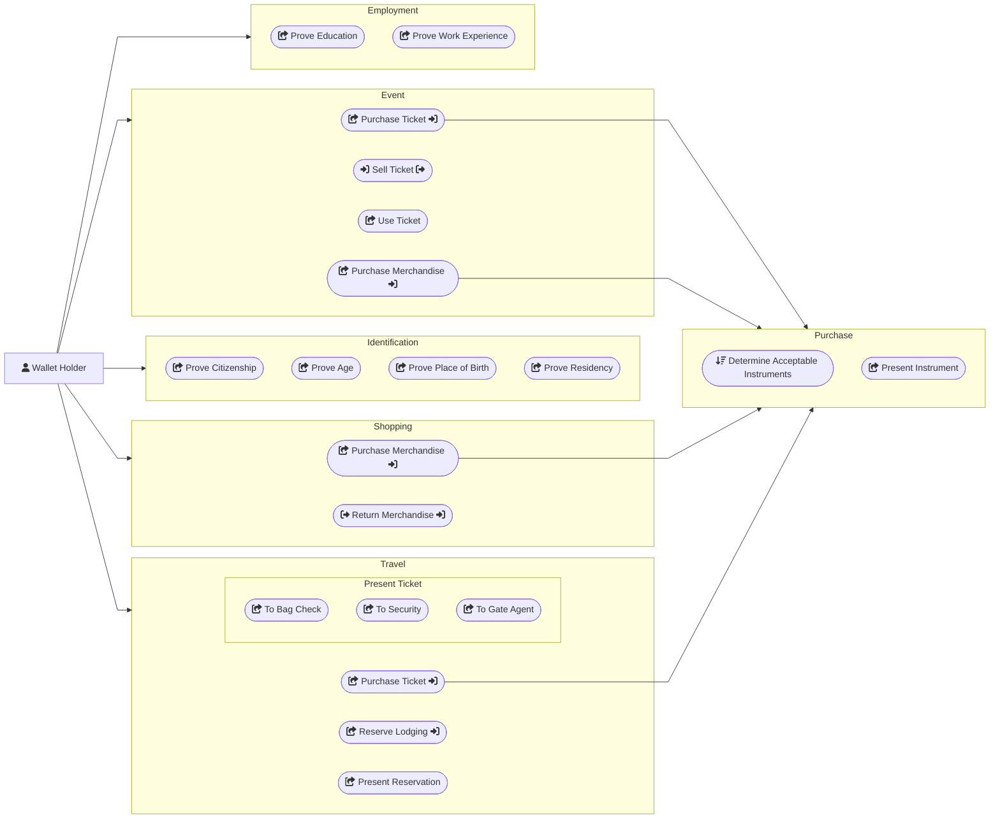

# Use Cases
This page will document the different use cases where a wallet is expected to be used.

```mermaid
%%{ init: { 'flowchart': { 'curve': 'linear' } } }%%
flowchart LR
  wh[fa:fa-user Wallet Holder]
  subgraph ev[Event]
    evUC1([fa:fa-share-from-square Purchase Ticket fa:fa-right-to-bracket])
    evUC2([fa:fa-right-to-bracket Sell Ticket fa:fa-right-from-bracket])
    evUC3([fa:fa-share-from-square Use Ticket])
    evUC4([fa:fa-share-from-square Purchase Merchandise fa:fa-right-to-bracket])
  end
  subgraph s[Shopping]
    sUC1([fa:fa-share-from-square Purchase Merchandise fa:fa-right-to-bracket])
    sUC2([fa:fa-right-from-bracket Return Merchandise fa:fa-right-to-bracket])
  end
  subgraph p[Purchase]
    pUC1([fa:fa-arrow-down-wide-short Determine Acceptable Instruments])
    pUC2([fa:fa-share-from-square Present Instrument])
  end
  subgraph i[Identification]
    iUC1([fa:fa-share-from-square Prove Citizenship])
    iUC2([fa:fa-share-from-square Prove Age])
    iUC3([fa:fa-share-from-square Prove Place of Birth])
    iUC4([fa:fa-share-from-square Prove Residency])
  end
  subgraph t[Travel]
    tUC1([fa:fa-share-from-square Purchase Ticket fa:fa-right-to-bracket])
    subgraph tpt[Present Ticket]
      tptUC1([fa:fa-share-from-square To Bag Check])
      tptUC2([fa:fa-share-from-square To Security])
      tptUC3([fa:fa-share-from-square To Gate Agent])
    end
    tUC2([fa:fa-share-from-square Reserve Lodging fa:fa-right-to-bracket])
    tUC3([fa:fa-share-from-square Present Reservation])
  end
  subgraph em[Employment]
   emUC1([fa:fa-share-from-square Prove Education])
   emUC2([fa:fa-share-from-square Prove Work Experience])
  end
  wh-->ev
  wh-->s
  wh-->i
  wh-->t
  wh-->em
  evUC1 & evUC4 & sUC1 & tUC1-->p
```