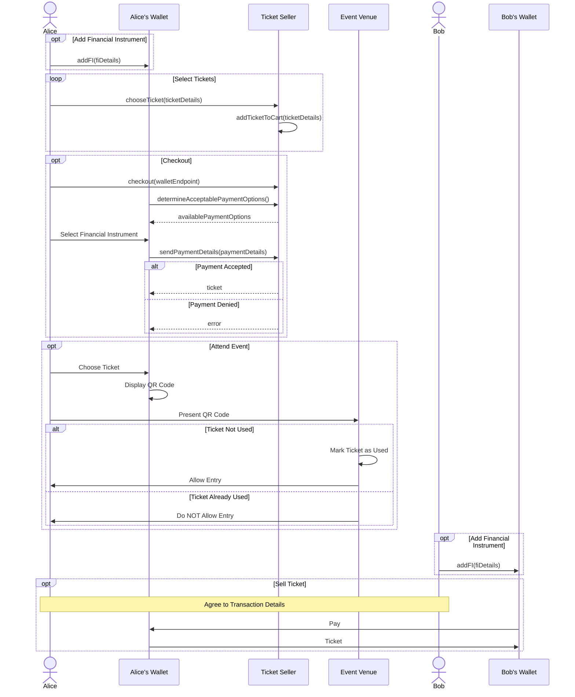

# Event Use Case

```mermaid
sequenceDiagram
  actor Alice
  participant aw as Alice's Wallet
  participant ts as Ticket Seller
  participant ev as Event Venue
  actor Bob
  participant bw as Bob's Wallet
  opt Add Financial Instrument
    Alice->>aw: addFI(fiDetails)
  end
  loop Select Tickets
    Alice->>ts: chooseTicket(ticketDetails)
    ts->>ts: addTicketToCart(ticketDetails)
  end
  opt Checkout
    Alice->>ts: checkout(walletEndpoint)
    aw->>ts: determineAcceptablePaymentOptions()
    ts-->>aw: availablePaymentOptions
    Alice->>aw: Select Financial Instrument
    aw->>ts: sendPaymentDetails(paymentDetails)
    alt Payment Accepted
      ts-->>aw: ticket
    else Payment Denied
      ts-->>aw: error
    end
  end
  opt Attend Event
    Alice->>aw: Choose Ticket
    aw->>aw: Display QR Code
    Alice->>ev: Present QR Code
    alt Ticket Not Used
      ev->>ev: Mark Ticket as Used
      ev->>Alice: Allow Entry
    else Ticket Already Used
      ev->>Alice: Do NOT Allow Entry
    end
  end
  opt Add Financial Instrument
    Bob->>bw: addFI(fiDetails)
  end
  opt Sell Ticket
    Note over Alice,Bob: Agree to Transaction Details
    bw->>aw: Pay
    aw->>bw: Ticket
  end
```