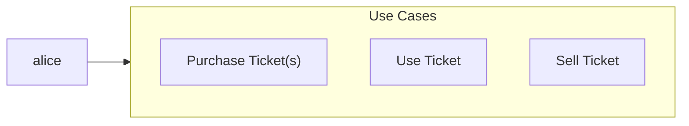
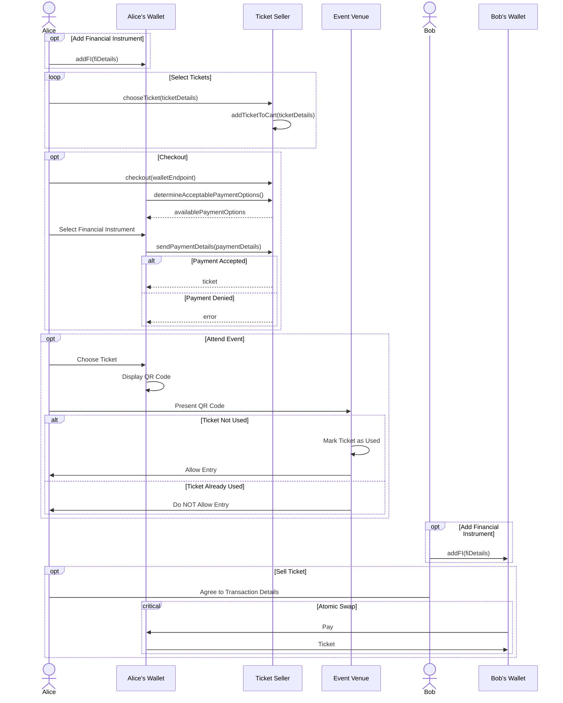

# Event Use Case

This document covers the typical use cases that would require a wallet when an individual wants to purchase ticket(s) and attend an event. In this scenario, we have a user Alice that will use a ticket seller's website to browse for ticket(s) to a specific event that they wish to attend. When Alice finds the specific seat(s) that they would like to purchase, they use their wallet to pay for the ticket(s). Upon successful payment, the ticket(s) are added to Alice's wallet. From here, there are two distinct steps that Alice can take:
1. Attend the event, which will require using the ticket to gain entry into the event venue
2. Sell the ticket to someone else, which will require transferring the ticket from Alice's wallet to the buyer's wallet

## Use Case Diagram

### Purchase Ticket
|                     |                |
|---------------------|----------------|
| **Use Case ID**     | Purchase Ticket |
| **User Story**      | As an Attendee, I want to purchase a ticket via a Ticket Seller to an event so that I may gain entry to the event at the Event Venue. |
| **Goal**            | Puchase a ticket so that I can attend an event. |
| **Actors**          | **Primary:** Attendee  |
|                     | **Secondary:** Ticket Seller, Event Venue |
| **Pre-Conditions**  | 1. The Attendee has access to the Ticket Seller.  2. The Attendee has a wallet with a valid financial instrument. |
| **Post-Conditions** | 1. The Attendee's has successfully purchased the ticket.  2. The Attendee's wallet contains the ticket. |
| **Trigger**         | The Attendee launches the Ticket Seller's (TS) website via their internet browser. |
| **Main Flow**       | 1. The TS website lists the different events available and provides a search mechanism.  2. The Attendee searches for the event they wish to attend.  3. The TS website displays events matching search criteria.  4. The Attendee clicks on the event to list the available seats.  5. The TS website displays the available seats.  6. The Attendee selects the seats they wish to reserve and clicks the "Reserve Seats" button.  7. The TS website displays the "Pay" page for the selected seats and requests payment.  8. The Attendee chooses to "Pay with their OWF-powered wallet".  9. The TS website redirects the Attendee to the OWF powered wallet to complete payment.  10. The Attendee chooses the payment instrument and submits the payment.  11. The OWF-powered wallet transmits payment instructions to the TS website.  12. The TS website validates payment.  13. Upon successful payment, the TS website displays receipt page, which includes a "Save Ticket to OWF-powered Wallet" option.  14. User selects "Save Ticket to OWF-Powered Wallet" button.  15. The TS website sends the ticket to the Attendee's OWF-powered Wallet.  16. Use Case Ends |
| **Exceptions**      | 1. Step 1. The TS website is down. 2. Step 2-10. The Attendee closes the browser window. The seats that have been reserved must be returned to available after a given amount of time. 3. Step 11. The transmission from the OWF-powered wallet to the TS website fails. The payment should not occur and the seats that have been reserved must be returned to available after a given amount of time.  4. Step 12. The payment is not successful. The seats that have been reserved must be returned to available after a given amount of time.  5. Step 13-14. The Attendee closes the browser window. The seats have been reserved and the attendee must have an alternative option to obtain the ticket.  6. Step 15. The transmission of the ticket from the TS website to the OWF-powered wallet fails. The seats have been reserved and the attendee must have an alternative option to obtain the ticket. |

### Use Ticket
| **Use Case ID**     |                |
|---------------------|----------------|
| **User Story**      |                |
| **Goal**            |                |
| **Actors**          | **Primary:**   |
|                     | **Secondary:** |
| **Pre-Conditions**  |                |
| **Post-Conditions** |                |
| **Trigger**         |                |
| **Main Flow**       |                |
| **Exceptions**      |                |

### Sell Ticket
| **Use Case ID**     |                |
|---------------------|----------------|
| **User Story**      |                |
| **Goal**            |                |
| **Actors**          | **Primary:**   |
|                     | **Secondary:** |
| **Pre-Conditions**  |                |
| **Post-Conditions** |                |
| **Trigger**         |                |
| **Main Flow**       |                |
| **Exceptions**      |                |

## Overall Sequence Diagram
