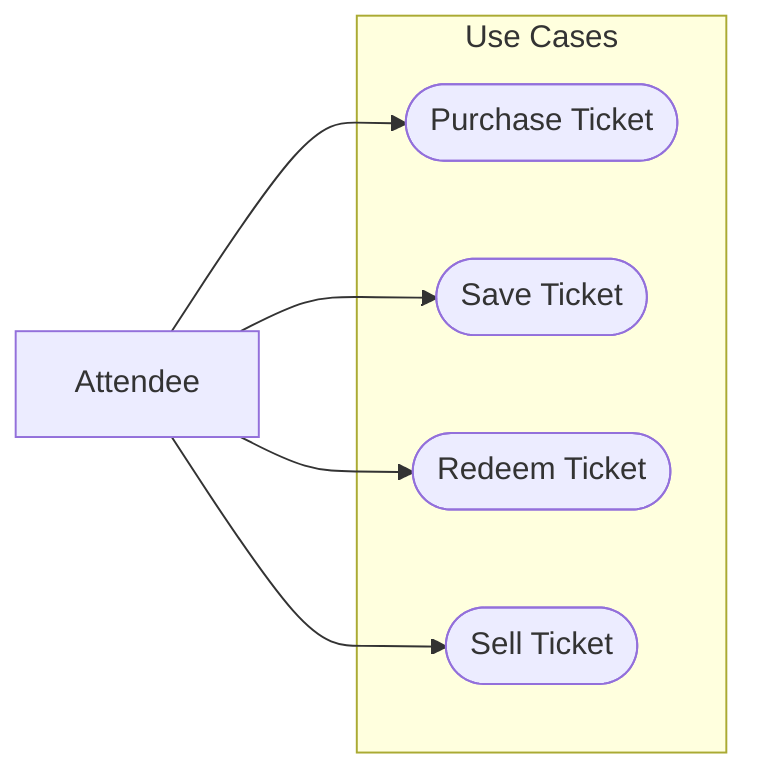

# Event Use Case

This document covers the typical use cases that would require a wallet when an individual wants to purchase ticket(s) and attend an event. In this scenario, we have an Attendee that will use a Ticket Seller's website to browse for ticket(s) to a specific event that they wish to attend. When the Attendee finds the specific seat(s) that they would like to purchase, they use their wallet to pay for the ticket(s). Upon successful payment, the ticket(s) are added to the Attendee's wallet. From here, there are two distinct steps that the Attendee can take:
1. Attend the event, which will require redeeming the ticket to gain entry into the Event Venue
2. Sell the ticket to someone else, which will require transferring the ticket from the Attendee's wallet to the Buyer's wallet

Potential Complexities:
* Two people should not be able to utilize the same ticket to gain access to the event.
* What considerations exist to ensure that the purchaser of the ticket is the one redeeming the ticket? For example, for stolen wallets or high-value tickets.

## Use Case Diagram

### Purchase Ticket
| **Use Case ID**     | Purchase Ticket |
|---------------------|----------------|
| **User Story**      | As an Attendee, I want to purchase a ticket via a Ticket Seller to an event so that I may gain entry to the event at the Event Venue. |
| **Goal**            | Puchase a ticket so that I can attend an event. |
| **Actors**          | **Primary:** Attendee |
|                     | **Secondary:** Ticket Seller (TS), Event Venue (EV) |
| **Pre-Conditions**  | 1. The Attendee has access to the Ticket Seller.  2. The Attendee has a wallet with a valid financial instrument. |
| **Post-Conditions** | 1. The Attendee's has successfully purchased the ticket. |
| **Trigger**         | The Attendee launches the Ticket Seller's (TS) website via their internet browser. |
| **Main Flow**       | 1. The TS website lists the different events available and provides a search mechanism.  2. The Attendee searches for the event they wish to attend.  3. The TS website displays events matching search criteria.  4. The Attendee clicks on the event to list the available seats.  5. The TS website displays the available seats.  6. The Attendee selects the seats they wish to reserve and clicks the "Reserve Seats" button.  7. The TS website displays the "Pay" page for the selected seats and requests payment.  8. The Attendee chooses to "Pay with their OWF-powered wallet".  9. The TS website redirects the Attendee to the OWF powered wallet to complete payment.  10. The Attendee chooses the payment instrument and submits the payment.  11. The OWF-powered wallet transmits payment instructions to the TS website.  12. The TS website validates payment.  13. Upon successful payment, the TS website sends information to the EV regarding the purchased ticket and marks the ticket as sold in the TS database  14. Upon successful payment, the TS website displays receipt page, which includes a "Save Ticket to OWF-powered Wallet" option.  15. Use Case Ends |
| **Exceptions**      | 1. Step 1. The TS website is down. 2. Step 2-10. The Attendee closes the browser window. The seats that have been reserved must be returned to available after a given amount of time. 3. Step 11. The transmission from the OWF-powered wallet to the TS website fails. The payment should not occur and the seats that have been reserved must be returned to available after a given amount of time.  4. Step 12. The payment is not successful. The seats that have been reserved must be returned to available after a given amount of time.  5. Step 13. The transmission between TS and EV fails. Corrective action must be made to ensure EV knows of valid ticket sale.  6. Step 13. The database update fails. Corrective action must be made to ensure that the ticket cannot be sold a second time.  7. Step 13-14. The Attendee closes the browser window. The seats have been reserved and the attendee must have an alternative option to obtain the ticket. |
| **Wallet Functionality Needed** | 1. Ability for a website to use the wallet as a payment mechanism. |

### Save Ticket
| **Use Case ID**     | Save Ticket |
|---------------------|----------------|
| **User Story**      | As a ticket purchaser, I want to save the ticket to my wallet. |
| **Goal**            | Save a ticket to the wallet so that I can attend an event. |
| **Actors**          | **Primary:** Ticket Purchaser (TP) |
|                     | **Secondary:** Ticket Seller (TS) |
| **Pre-Conditions**  | 1. The ticket purchaser has a wallet.  2. The ticket purchaser has purchased a ticket (see _Purchase Ticket_ use case) |
| **Post-Conditions** | 1. The Attendee's wallet contains the ticket. |
| **Trigger**         | The Ticket Purchaser clicks the "Save Ticket to OWF-powered Wallet" option on the Ticket Seller's website or email. |
| **Main Flow**       | 1. The TS system sends the ticket to the Attendee's OWF-powered Wallet.  2. Use Case Ends. |
| **Exceptions**      | 1. Step 1. The transmission of the ticket from the TS system to the OWF-powered wallet fails. The ticket purchaser must be able to retry to save functionality again or have an alternative way to obtain the ticket. |
| **Wallet Functionality Needed** | 1. Ability to save a ticket to the wallet. |

### Redeem Ticket
| **Use Case ID**     | Redeem Ticket |
|---------------------|----------------|
| **User Story**      | As a Ticket Holder, I want to be able to gain entry to an event at the Event Venue by redeeming my ticket. |
| **Goal**            | Gain entry to an event by redeeming my ticket. |
| **Actors**          | **Primary:** Ticket Holder (TH) |
|                     | **Secondary:** Event Venue (EV)|
| **Pre-Conditions**  | 1. The Ticket Holder has a ticket within their wallet.  2. The Ticket Holder is at the Event Venue. |
| **Post-Conditions** | 1. The Ticket Holder has gained access to the event.  2. The Ticket has been marked as redeemed (i.e., the ticket not be used again to gain entry). |
| **Trigger**         | The Ticket Holder reaches the front of the queue at the Event Venue. |
| **Main Flow**       | 1. The Ticket Holder (TH) opens their wallet and searches their wallet for the specific event ticket.  2. The Wallet displays the event matching the search criteria.  3. The TH clicks the specific event.  4. The wallet determines the correct mechanism used to gain access to the Event Venue and displays the selected ticket using the appropriate mechanism.  5. The TH presents the ticket to the Event Venue's device reader.   6. The device reader queries the EV's system to ensure the ticket is valid and displays validity to the Event Venue attendant.  7. The Event Venue allows the TH access to the event. 8. Use Case Ends |
| **Exceptions**      | 1. Step 1-5. The TH steps out of line. The TH is not allowed access to the event.  2. Step 1-5. The TH cannot locate the ticket to the event in their wallet. The TH is not allowed access to the event.  3. Step 6. The ticket is not valid. The Ticket Holder is not allowed access to the event. |
| **Wallet Functionality Needed** | 1. Ability to view all event tickets in the wallet.  2. Ability to use a specific ticket to gain entry to an event (mechanisms may include QR code, barcode, NFC tap).  3. Ability to view the tickets in the wallet without data access (device download). |

### Sell Ticket
| **Use Case ID**     | Sell Ticket |
|---------------------|----------------|
| **User Story**      | As a Ticket Holder, I want to be able to sell my ticket to another person. |
| **Goal**            | Sell a ticket to a secondary buyer so that they may gain access to the event. |
| **Actors**          | **Primary:** Ticket Holder (TH), Ticket Buyer (TB)   |
|                     | **Secondary:** Event Venue (EV) |
| **Pre-Conditions**  | 1. The TH has a ticket in their wallet. |
| **Post-Conditions** | 1. The TB has the ticket in their wallet.  2. The TH no longer has the ticket in their wallet. |
| **Trigger**         | The TH and TB agree to the terms of the sale. |
| **Main Flow**       | 1. The TB pays the TH for the ticket.  2. The TH transfers the ticket to the TB's wallet.  3. Use Case Ends. |
| **Exceptions**      | 1. Step 1-2. Both of these steps should be atomic in nature. If one fails, the other should also fail to complete. |
| **Wallet Functionality Needed** | 1. Ability to view all event tickets in the wallet.  2. Ability to transfer an event ticket to another wallet. |

## Overall Sequence Diagram
